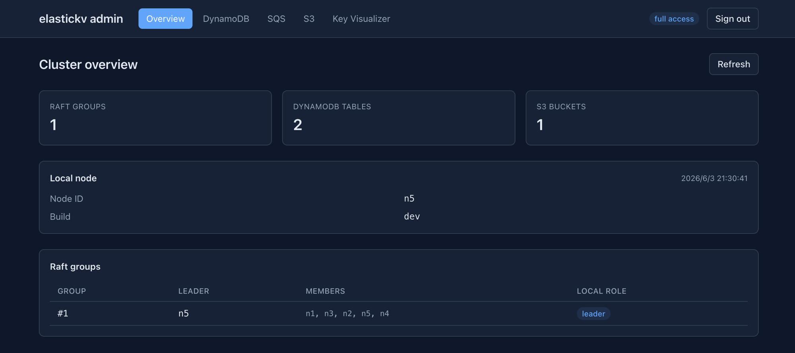
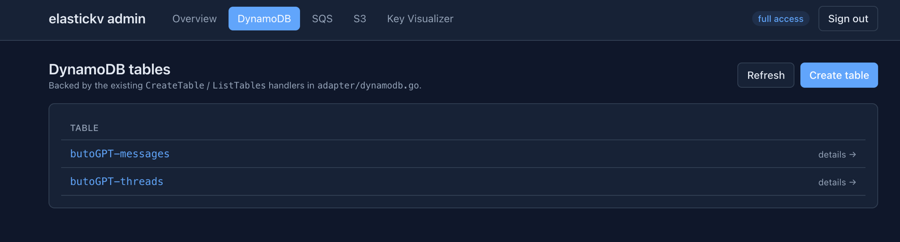
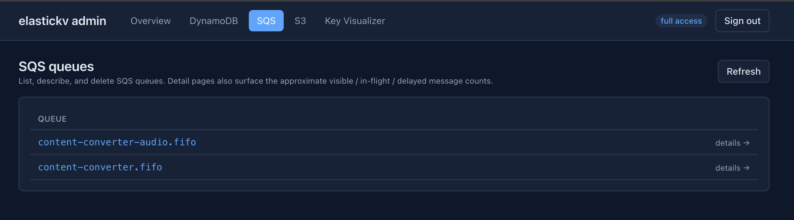
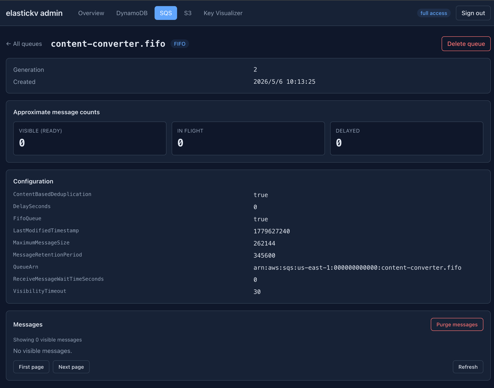
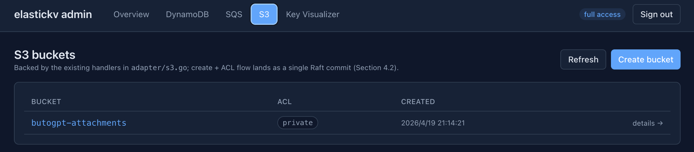

# Elastickv

## Overview
Elastickv is an experimental distributed key-value store backed by Raft. It exposes gRPC, Redis-compatible, DynamoDB-compatible, S3-compatible, and SQS-compatible APIs, plus an optional FUSE filesystem. Sharded storage, durable route management, and several operator tools are implemented; automatic cross-group data relocation and node scaling remain future work.

**THIS PROJECT IS CURRENTLY UNDER DEVELOPMENT AND IS NOT READY FOR PRODUCTION USE.**

## Implemented Features
- **Raft-based Data Replication**: KV state replication is implemented on Raft, with leader-based commit and follower forwarding paths.
- **Shard-aware Data Plane**: Static shard ranges across multiple Raft groups with shard routing/coordinator are implemented.
- **Route Management and Load Distribution**: A durable route catalog, versioned route snapshots, watcher-based refresh, and manual `ListRoutes`/`SplitRange` are implemented. Opt-in `--autoSplit` detects hot ranges and splits them within the same Raft group; opt-in `--leaderBalance` distributes Raft-group leadership among existing voters.
- **Protocol Adapters**: gRPC (`RawKV`/`TransactionalKV`), Redis-compatible server, DynamoDB-compatible HTTP API, S3-compatible HTTP API, and SQS-compatible HTTP API implementations are available (runtime exposure depends on the selected server entrypoint/configuration).
- **Redis Compatibility Scope**: Strings, hashes, lists, sets, sorted sets, HyperLogLog, streams (`XADD`/`XREAD`/`XRANGE`/`XREVRANGE`/`XTRIM`/`XLEN`), Pub/Sub (`PUBLISH`/`SUBSCRIBE`), transactions (`MULTI`/`EXEC`/`DISCARD`), TTL/expiry (`EXPIRE`/`PEXPIRE`/`TTL`/`PTTL`), key scanning (`KEYS`/`SCAN`), and Lua scripting (`EVAL`/`EVALSHA`) are implemented. A Redis-protocol reverse proxy (`cmd/redis-proxy`) supports phased zero-downtime migration from existing Redis deployments.
- **DynamoDB Compatibility Scope**: `CreateTable`/`DeleteTable`/`DescribeTable`/`ListTables`/`PutItem`/`GetItem`/`DeleteItem`/`UpdateItem`/`Query`/`Scan`/`BatchWriteItem`/`TransactWriteItems` are implemented.
- **S3 Compatibility Scope**: Bucket and object operations, bucket-level `private`/`public-read` ACLs, and multipart uploads are implemented for path-style requests. AWS Signature Version 4 authentication with static credentials is supported. The server exposes this endpoint via `--s3Address`.
- **SQS Compatibility Scope**: Standard and FIFO queues support queue management, send/receive/delete (including batch operations), visibility timeouts, long polling, tags, and dead-letter queue redrive. JSON and Query/XML request protocols are supported. The public endpoint is opt-in via `--sqsAddress` and supports static SigV4 credentials.
- **FUSE Filesystem**: An opt-in mount (`--filesystemMount`) exposes regular files and directories backed by the sharded KV store. It supports offset reads/writes, sparse files, truncation, directory listing, same-directory rename, and unlink while a file is open. File data uses fixed-size chunks placed on one home shard per file in normal operation; see [Working with the FUSE filesystem](#working-with-the-fuse-filesystem) for setup and limits.
- **Backup and Encryption Operations**: Live point-in-time logical backup and offline snapshot conversion tools are available. Opt-in storage and Raft envelope encryption paths are implemented, while the overall encryption design remains partial. See the [backup runbook](docs/operations/backup_restore.md) and [encryption status](docs/design/2026_04_29_partial_data_at_rest_encryption.md) before operating these features.
- **Basic Consistency Behaviors**: Write-after-read checks, leader redirection/forwarding paths, and OCC conflict detection for transactional writes are covered by tests.
- **Timestamp Issuance**: The default path uses a 64-bit hybrid logical clock (HLC) with a Raft-committed physical-time ceiling. An optional dedicated group-0 timestamp oracle supports staged `legacy`, `shadow`, `cutover`, and `phase-d` modes; see [Centralized TSO Operations](docs/centralized_tso_operations.md).

## Planned Features
- **Dynamic Node Scaling**: Adding/removing nodes and groups automatically based on load is not yet implemented.
- **Cross-group Hot Spot Re-allocation**: Automatic splitting currently keeps both ranges in the same Raft group; automatic cross-group data migration and placement are not yet implemented.

## Development Status
Elastickv remains experimental. Protocol and POSIX compatibility are limited to the operations documented below. Contributions and feedback are welcome.

## Architecture

Architecture diagrams are available in:

- `docs/architecture_overview.md`

Deployment/runbook documents:

- `docs/docker_multinode_manual_run.md` (manual `docker run`, 4-5 node cluster on multiple VMs, no docker compose)
- `docs/etcd_raft_migration_operations.md` (offline HashiCorp-to-etcd cutover runbook and verification checklist)
- `docs/redis-proxy-deployment.md` (Redis-protocol reverse proxy for zero-downtime Redis-to-Elastickv migration)
- `docs/operations/backup_restore.md` and `docs/operations/snapshot_restore.md` (backup and restore procedures)
- `docs/centralized_tso_operations.md` and `docs/raft_learner_operations.md` (timestamp oracle and cluster membership operations)

Design documents:

- `docs/design/2026_03_22_implemented_s3_compatible_adapter.md` (S3-compatible object storage adapter design, data model, routing, and rollout plan)
- `docs/design/2026_04_24_implemented_sqs_compatible_adapter.md` (SQS-compatible queues)
- `docs/design/2026_02_24_implemented_filesystem_on_elastickv.md` (filesystem operations, FUSE, placement, and limitations)
- `docs/design/2026_06_11_implemented_hotspot_split_milestone3_automation.md` (automatic same-group range splitting)

## Metrics and Grafana

Elastickv now exposes Prometheus metrics on `--metricsAddress` (default: `localhost:9090` in `main.go`, `127.0.0.1:9090` in `cmd/server/demo.go` single-node mode). The built-in 3-node demo binds metrics on `0.0.0.0:9091`, `0.0.0.0:9092`, and `0.0.0.0:9093`, and uses the bearer token `demo-metrics-token` unless `--metricsToken` is set.

The exported metrics cover:

- DynamoDB-compatible API request rate, success/system-error/user-error split, latency, in-flight requests, and per-table read/write activity
- Raft local state, leader identity, membership, leader changes seen, failed proposals, last-log/commit/applied/snapshot index, FSM backlog, and leader contact lag
- Redis, SQS, filesystem, automatic split, leader balancing, TSO, and encryption operational signals

Provisioned monitoring assets live under:

- `monitoring/prometheus/prometheus.yml`
- `monitoring/grafana/dashboards/elastickv-cluster-overview.json`
- `monitoring/grafana/dashboards/elastickv-dynamodb.json`
- `monitoring/grafana/dashboards/elastickv-raft-status.json`
- `monitoring/grafana/dashboards/elastickv-redis-summary.json`
- `monitoring/grafana/dashboards/elastickv-sqs.json`
- `monitoring/grafana/dashboards/elastickv-filesystem.json`
- `monitoring/grafana/dashboards/elastickv-pebble-internals.json`
- `monitoring/grafana/provisioning/`
- `monitoring/docker-compose.yml`

The provisioned dashboards are organized by operator task:

- `Elastickv Cluster` is the landing page for leader identity, cluster-wide latency/error posture, and per-node Raft health
- `Elastickv DynamoDB` is the DynamoDB-compatible API drilldown for slow operations, noisy nodes, and hot/erroring tables
- `Elastickv Raft Status` is the control-plane drilldown for membership, leader changes, failed proposals, node state, index drift, backlog, and leader contact
- `Elastickv Redis` is the Redis-compatible API drilldown for per-command throughput/latency/errors, with a collapsible `Hot Path` row for GET fast-path (PR #560) verification
- `Elastickv SQS` shows queue depth, in-flight and delayed messages, and FIFO partition activity
- `Elastickv Filesystem` shows file placement, chunk I/O, open-handle leases, orphan cleanup, and move activity
- `Elastickv Pebble Internals` is the storage-engine drilldown for block cache, L0 pressure, compactions, memtables, and store write conflicts

If you bind `--metricsAddress` to a non-loopback address, `--metricsToken` is required. Prometheus must send the same bearer token, for example:

```yaml
scrape_configs:
  - job_name: elastickv
    authorization:
      type: Bearer
      credentials: YOUR_METRICS_TOKEN
```

To scrape a multi-node deployment, bind `--metricsAddress` to each node's private IP and set `--metricsToken`, for example `--metricsAddress "10.0.0.11:9090" --metricsToken "YOUR_METRICS_TOKEN"`.

For the local 3-node demo, start Grafana and Prometheus with:

```bash
cd monitoring
docker compose up -d
```

`monitoring/prometheus/prometheus.yml` assumes the demo token `demo-metrics-token`. If you override `--metricsToken` when running `go run ./cmd/server/demo.go`, update `authorization.credentials` in that file to match.


## Admin Dashboard

Elastickv ships an optional admin dashboard — a React SPA plus JSON API served from a separate HTTP listener (default `127.0.0.1:8080`). It is **disabled by default**; enable the listener with `--adminEnabled` and configure authentication as described in [`docs/admin.md`](docs/admin.md). The dashboard inspects cluster/Raft state, includes a key visualizer and data browser, and manages DynamoDB tables, SQS queues, and S3 buckets without hand-rolling SigV4 requests. Any node with `--adminEnabled` can serve it: writes against a follower are transparently forwarded to the leader. See [`docs/design/2026_04_24_implemented_admin_dashboard.md`](docs/design/2026_04_24_implemented_admin_dashboard.md) for the design rationale.

**Cluster overview** — leader identity, Raft group membership/local role, and resource counts.



**DynamoDB tables** — list, create, and inspect tables backed by the existing `CreateTable` / `ListTables` handlers.



**SQS queues** — list, describe, and delete queues; detail pages surface approximate visible / in-flight / delayed message counts and queue configuration.





**S3 buckets** — list and create buckets, with ACL and creation metadata.




## Example Usage

This section provides sample commands to demonstrate how to use the project. Make sure you have the necessary dependencies installed before running these commands.

### Starting the Server
These commands bootstrap a fresh single-node cluster. For a multi-node deployment, follow the [manual deployment runbook](docs/docker_multinode_manual_run.md). To start a single node with the default `etcd/raft` runtime, use:
```bash
go run . \
  --address "127.0.0.1:50051" \
  --redisAddress "127.0.0.1:6379" \
  --raftId "n1" \
  --raftBootstrap
```

To enable the S3 and SQS endpoints alongside metrics:
```bash
go run . \
  --address "127.0.0.1:50051" \
  --redisAddress "127.0.0.1:6379" \
  --dynamoAddress "127.0.0.1:8000" \
  --s3Address "127.0.0.1:9000" \
  --s3Region "us-east-1" \
  --s3CredentialsFile "/etc/elastickv/credentials.json" \
  --sqsAddress "127.0.0.1:9324" \
  --sqsRegion "us-east-1" \
  --sqsCredentialsFile "/etc/elastickv/credentials.json" \
  --metricsAddress "127.0.0.1:9090" \
  --raftId "n1" \
  --raftBootstrap
```

The S3 and SQS listeners can share a static credentials file. Create `/etc/elastickv/credentials.json` before starting the server, with credentials matching the client configuration:

```json
{"credentials":[{"access_key_id":"YOUR_ACCESS_KEY","secret_access_key":"YOUR_SECRET_KEY"}]}
```

### Running with the etcd/raft backend

`etcd/raft` is the default backend:

```bash
go run . \
  --address "127.0.0.1:50051" \
  --redisAddress "127.0.0.1:6379" \
  --raftId "n1" \
  --raftBootstrap
```

`etcd` is the only supported engine; `--raftEngine` accepts no other value.
Elastickv writes a `raft-engine` marker into each Raft data directory and refuses
to reopen a directory with a different backend. A node also refuses to start on a
directory that still holds legacy HashiCorp Raft artifacts (`raft.db`).

The legacy HashiCorp Raft backend and its offline migrator
(`cmd/etcd-raft-migrate`) were removed in commit `a35245a` once the one-time
migration to `etcd/raft` was complete. If you still need to migrate an old
HashiCorp-backed store, run the migrator by checking out the whole repository at
the commit before `a35245a` (`a35245a^`) — extracting a single file will not
build, because the migrator links against module dependencies that were dropped
along with it. See `docs/etcd_raft_migration_operations.md` for the historical
procedure.

### Starting the Client

To start the client, use this command:
```bash
go run cmd/client/client.go
```

### Working with the FUSE filesystem

On a host with FUSE support, create a mount directory and start a fresh single-node server with the filesystem enabled:

```bash
mkdir -p /tmp/elastickv-mount
go run . \
  --address "127.0.0.1:50051" \
  --redisAddress "127.0.0.1:6379" \
  --raftId "n1" \
  --raftBootstrap \
  --filesystemMount "/tmp/elastickv-mount" \
  --filesystemRootUID "$(id -u)" \
  --filesystemRootGID "$(id -g)"
```

In another terminal, use normal file commands:

```bash
mkdir /tmp/elastickv-mount/docs
printf 'hello\n' > /tmp/elastickv-mount/docs/hello.txt
cat /tmp/elastickv-mount/docs/hello.txt
```

The root owner and mode flags apply when the filesystem root is first created; the defaults are UID/GID `0` and mode `0755`. `--filesystemClientID` defaults to `--raftId` and identifies open-handle leases. `--filesystemCapacity` and `--filesystemMaxFiles` set values reported by `statfs`; they do not enforce write quotas. The server unmounts the filesystem during shutdown.

This FUSE implementation supports regular files and directories, but not cross-directory rename, hard links, symbolic links, extended attributes, or full POSIX locking. See the [filesystem design](docs/design/2026_02_24_implemented_filesystem_on_elastickv.md) for the supported operations and placement model.

### Working with Redis
To start the Redis client:
```bash
redis-cli -p 6379
```

The separate three-node demo (`go run ./cmd/server/demo.go`) uses Redis ports `63791`–`63793`.

#### Setting and Getting Key-Value Pairs
To set a key-value pair and retrieve it:
```bash
set key value
get key
quit
```

#### Sorted Sets, Streams, and Other Data Structures
The Redis adapter supports the full range of Redis data structures including sorted sets (`ZADD`/`ZRANGE`/`ZSCORE`), HyperLogLog (`PFADD`/`PFCOUNT`), streams (`XADD`/`XREAD`/`XRANGE`), sets (`SADD`/`SMEMBERS`), hashes (`HGET`/`HSET`/`HGETALL`), and Pub/Sub (`PUBLISH`/`SUBSCRIBE`). Lua scripts can be executed via `EVAL` and `EVALSHA`.

#### Migrating from Redis

A Redis-protocol reverse proxy (`redis-proxy`) enables phased zero-downtime migration. It supports dual-write, shadow-read comparison, and primary cutover modes. See `docs/redis-proxy-deployment.md` for the full deployment guide.

```bash
# Run redis-proxy in dual-write mode (writes to both Redis and Elastickv)
# The proxy listens on :6479 inside the container, exposed as :6379 on the host
# so existing clients can connect without changing their configuration.
docker run --rm \
  -p 6379:6479 \
  ghcr.io/bootjp/elastickv/redis-proxy:latest \
  -listen :6479 \
  -primary redis.internal:6379 \
  -secondary elastickv.internal:6380 \
  -elastickv-pool-size 192 \
  -secondary-write-concurrency 96 \
  -secondary-script-concurrency 3 \
  -secondary-blocking-replay-concurrency 32 \
  -mode dual-write
```

### Working with SQS-compatible Queues

Set `--sqsAddress` and `--sqsCredentialsFile` on the server as shown above, then use matching AWS CLI credentials and region:

```bash
aws configure set aws_access_key_id YOUR_ACCESS_KEY
aws configure set aws_secret_access_key YOUR_SECRET_KEY
aws --endpoint-url http://localhost:9324 --region us-east-1 sqs create-queue \
  --queue-name jobs
aws --endpoint-url http://localhost:9324 --region us-east-1 sqs list-queues
```

Standard and FIFO queues support the JSON and Query/XML SQS protocols. See the [SQS adapter design](docs/design/2026_04_24_implemented_sqs_compatible_adapter.md) for the supported operation list and limitations.

### Working with S3-compatible Storage

Elastickv exposes an S3-compatible HTTP API when `--s3Address` is set (for example `127.0.0.1:9000`). Any S3 client or SDK that supports path-style requests and AWS Signature Version 4 can connect to it.

```bash
# Configure the AWS CLI to point at Elastickv
aws configure set aws_access_key_id YOUR_ACCESS_KEY
aws configure set aws_secret_access_key YOUR_SECRET_KEY
aws configure set region us-east-1

# Create a bucket
aws --endpoint-url http://localhost:9000 s3api create-bucket --bucket my-bucket

# Upload an object
aws --endpoint-url http://localhost:9000 s3api put-object \
  --bucket my-bucket --key hello.txt --body hello.txt

# Download an object
aws --endpoint-url http://localhost:9000 s3api get-object \
  --bucket my-bucket --key hello.txt /tmp/hello.txt

# List objects
aws --endpoint-url http://localhost:9000 s3api list-objects-v2 \
  --bucket my-bucket
```

#### Public Bucket Access

Buckets support a bucket-level ACL that allows anonymous (unauthenticated) read access. Supported canned ACL values are `private` (default) and `public-read`.

```bash
# Create a public bucket
aws --endpoint-url http://localhost:9000 s3api create-bucket \
  --bucket public-assets --acl public-read

# Change an existing bucket to public
aws --endpoint-url http://localhost:9000 s3api put-bucket-acl \
  --bucket my-bucket --acl public-read

# Check a bucket's ACL
aws --endpoint-url http://localhost:9000 s3api get-bucket-acl \
  --bucket my-bucket

# Anonymous download (no credentials required)
curl http://localhost:9000/public-assets/hello.txt

# Revert to private
aws --endpoint-url http://localhost:9000 s3api put-bucket-acl \
  --bucket my-bucket --acl private
```

Public buckets allow unauthenticated `GetObject`, `HeadObject`, `HeadBucket`, and `ListObjectsV2`. Write operations (`PutObject`, `DeleteObject`, multipart uploads) always require authentication. `ListBuckets` and ACL management also always require authentication.

See `docs/design/2026_03_22_implemented_s3_compatible_adapter.md` for the full data model, consistency guarantees, multipart upload design, and rollout plan. See `docs/design/2026_04_01_implemented_s3_public_bucket.md` for the public bucket ACL design.

### Connecting to a Follower Node
The following follower examples use the separate three-node demo (`go run ./cmd/server/demo.go`), which binds Redis on ports `63791`–`63793`. To connect to a follower node:
```bash
redis-cli -p 63792
get key
```

### Redirecting Set Operations to Leader Node
```bash
redis-cli -p 63792
set bbbb 1234
get bbbb
quit

redis-cli -p 63793
get bbbb
quit

redis-cli -p 63791
get bbbb
quit
```

### Manual Route Split API

The manual control-plane APIs on `proto.Distribution` are:

1. `ListRoutes`
2. `SplitRange` (same-group split only)

Use `grpcurl` against a running node:

```bash
# 1) Read current durable route catalog
grpcurl -plaintext -d '{}' localhost:50051 proto.Distribution/ListRoutes

# 2) Split route 1 at user key "g" (bytes are base64 in grpcurl JSON: "g" -> "Zw==")
grpcurl -plaintext -d '{
  "expectedCatalogVersion": 1,
  "routeId": 1,
  "splitKey": "Zw=="
}' localhost:50051 proto.Distribution/SplitRange
```

Example `SplitRange` response:

```json
{
  "catalogVersion": "2",
  "left": {
    "routeId": "3",
    "start": "",
    "end": "Zw==",
    "raftGroupId": "1",
    "state": "ROUTE_STATE_ACTIVE",
    "parentRouteId": "1"
  },
  "right": {
    "routeId": "4",
    "start": "Zw==",
    "end": "bQ==",
    "raftGroupId": "1",
    "state": "ROUTE_STATE_ACTIVE",
    "parentRouteId": "1"
  }
}
```

Notes:

1. `expectedCatalogVersion` must match the latest `ListRoutes.catalogVersion`.
2. `splitKey` must be strictly inside the parent range (not equal to range start/end).
3. Manual split keeps both children in the same Raft group as the parent.


### Development

### Running Jepsen tests

Jepsen tests live in `jepsen/`. Install Leiningen and run tests locally:

```bash
curl -L https://raw.githubusercontent.com/technomancy/leiningen/stable/bin/lein > ~/lein
chmod +x ~/lein
(cd jepsen && ~/lein test)
```

These Jepsen tests execute concurrent read and write operations while a nemesis
injects random network partitions. Jepsen's linearizability checker verifies the
history.


### Setup pre-commit hooks
```bash
git config --local core.hooksPath .githooks
```
