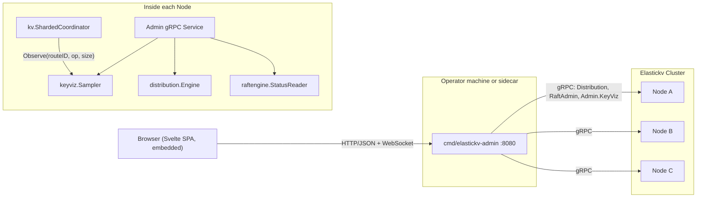

# Admin UI and Key Visualizer Design for Elastickv

## 1. Background

Elastickv currently exposes four data-plane surfaces (gRPC `RawKV`/`TransactionalKV`, Redis, DynamoDB, S3) and one control-plane surface (`Distribution.ListRoutes`, `SplitRange`). Operational insight is provided today by:

- Prometheus metrics on `--metricsAddress` (default `:9090`), backed by `monitoring.Registry` (`monitoring/registry.go:12`).
- Pre-built Grafana dashboards under `monitoring/grafana/`.
- `grpcurl` against the `Distribution` and `RaftAdmin` services.
- `cmd/raftadmin` and `cmd/client` CLIs.

There is no first-party Web UI, and — critically — no per-key or per-route traffic signal. Operators cannot answer questions such as "which key range is hot right now?", "is the load skewed across Raft groups?", or "did the last `SplitRange` actually relieve the hotspot?" without building ad-hoc Prometheus queries, and even those queries cannot drill below the Raft-group aggregate.

This document proposes a built-in admin Web UI, shipped as a separate binary `cmd/elastickv-admin`, and a TiKV-style **Key Visualizer** that renders a time × key-range heatmap of load. The design reuses existing control-plane gRPC APIs (routes, Raft status) and adds a minimal, hot-path-safe sampler for per-route traffic. The initial milestones intentionally avoid depending on the Prometheus client library so that the admin binary remains independently buildable and shippable.

## 2. Goals and Non-goals

### 2.1 Goals

1. Ship a standalone admin binary `cmd/elastickv-admin` that connects to one or more elastickv nodes over gRPC and serves a Web UI.
2. Provide a single UI that covers cluster overview, routes, Raft groups, adapter throughput, and the key visualizer.
3. Produce a time × key-space heatmap with at least four switchable series: read count, write count, read bytes, write bytes.
4. Follow hotspot shards across `SplitRange` / merge events so the heatmap stays continuous.
5. Keep the sampler's hot-path overhead within the measurement noise floor; define success as "≥95% of operations captured with no detectable regression in coordinator benchmarks."
6. Stay off the Prometheus client library in Phases 0–3. Traffic counters used by the UI are maintained by the in-process sampler and a small adapter-side aggregator that already exists on the hot path.
7. Make the admin binary easy to deploy: a single Go binary with the SPA embedded via `go:embed`, producing one artifact per platform in CI.

### 2.2 Non-goals

1. Replacement of the existing Grafana dashboards. The admin UI focuses on cluster state and the keyspace view; long-horizon trend analysis remains a Prometheus/Grafana concern.
2. Per-individual-key statistics. The visualizer operates on route-level buckets, not on a `GET` / `PUT` trace.
3. Authentication or authorization in the initial milestones. The admin binary binds to localhost by default and expects operators to layer their own access control (SSH tunnel, reverse proxy, network ACL). Authentication is out of scope for Phases 0–4.
4. Query console (SQL/Redis/DynamoDB REPL) inside the UI. Deferred.
5. Multi-cluster federation. Scope is a single cluster; the admin binary may target any single node.

## 3. High-level Architecture



The admin binary holds no authoritative state. All data is fetched on demand from nodes via a new `Admin` gRPC service. The sampler's ring buffer lives inside each node's process, rebuildable after restart (see §5.5).

### 3.1 Why a separate binary

- Release cadence for the UI is decoupled from the data plane.
- The admin binary can be placed on an operator workstation or a sidecar pod, so a compromised UI does not imply a compromised data node.
- Node binaries remain free of the Prometheus client (goal §2.1-6) and of any SPA assets.
- `cmd/elastickv-admin --node=host:50051` is the full invocation; no config files are required for the default use case.

## 4. API Surface

Two layers:

**Layer A — gRPC, node → admin binary.** A new `Admin` service on each node, registered on the same gRPC port as `RawKV` (`--address`, default `:50051`). All methods are read-only in Phases 0–3.

| RPC | Purpose |
|---|---|
| `GetClusterOverview` | Node identity, Raft leader map per group, aggregate QPS |
| `ListRoutes` | Existing `Distribution.ListRoutes` (reused, not duplicated) |
| `GetRaftGroups` | Per-group state (leader, term, commit/applied, last contact) |
| `GetAdapterSummary` | Per-adapter QPS and latency quantiles from the in-process aggregator |
| `GetKeyVizMatrix` | Heatmap matrix (see §5.4) |
| `GetRouteDetail` | Time series for one route (drill-down) |
| `StreamEvents` | Server-stream of route-state transitions and fresh matrix columns |

**Layer B — HTTP/JSON, browser → admin binary.** Thin pass-through wrappers over the gRPC calls, plus static asset serving.

| Method | Path | Purpose |
|---|---|---|
| GET | `/` (and `/assets/*`) | Embedded SPA |
| GET | `/api/cluster/overview` | Wraps `GetClusterOverview` |
| GET | `/api/routes` | Wraps `ListRoutes` + derived size/leader |
| GET | `/api/raft/groups` | Wraps `GetRaftGroups` |
| GET | `/api/adapters/summary` | Wraps `GetAdapterSummary` |
| GET | `/api/keyviz/matrix` | Wraps `GetKeyVizMatrix` |
| GET | `/api/keyviz/routes/{routeID}` | Wraps `GetRouteDetail` |
| WS  | `/api/stream` | Multiplexes `StreamEvents` from all targeted nodes |

HTTP errors use a minimal `{code, message}` envelope. No caching headers on read endpoints.

### 4.1 `GetKeyVizMatrix` parameters

| Field | Type | Default | Notes |
|---|---|---|---|
| `series` | enum(`reads`,`writes`,`readBytes`,`writeBytes`) | `writes` | Selects which counter is returned |
| `from` | timestamp | now−1h | Inclusive |
| `to` | timestamp | now | Exclusive |
| `rows` | int | 256 | Target Y-axis resolution (server may return fewer) |

Response matrix format: `matrix[i][j]` is the value for bucket `i` at time column `j`. Keys in `start`/`end` are raw bytes; the server supplies `label` as a printable preview (§5.6).

## 5. Key Visualizer

### 5.1 Sampling point

A single call site is added at the dispatch entry of `kv.ShardedCoordinator` (see `kv/sharded_coordinator.go`), immediately after the request is resolved to a `RouteID`:

```go
sampler.Observe(routeID, op, keyLen, valueLen)
```

`sampler` is an interface; the default implementation is lock-free and nil-safe, so a nil sampler compiles to a predictable branch and no allocation. The hook runs *before* Raft proposal so it measures offered load, not applied load.

Reads and writes are both sampled on the leader. Followers do not sample, because follower-local reads flow through the same coordinator path on the follower.

### 5.2 Adaptive sub-sampling and the 95% SLO

Observing every call is cheap but not free. To guarantee "no detectable regression," the sampler uses **adaptive 1-in-N sampling per route**:

- Each route maintains an atomic `sampleRate` counter.
- Under low load (below a threshold QPS per route), `sampleRate = 1` (every op counted).
- As per-route QPS rises, `sampleRate` doubles stepwise, and the increment applied is multiplied by `sampleRate` so counters remain unbiased estimators.
- The controller targets **≥95% capture rate** in steady state: `sampleRate` is only raised when the write contention on the atomic increment itself crosses a noise-floor CPU threshold, measured at flush time.
- Worst-case error on per-bucket totals is bounded by `1/sqrt(observedSamples)`, so buckets with fewer samples are tagged in the response for the UI to hatch them.

Benchmark gate in CI: run `BenchmarkCoordinatorDispatch` with the sampler disabled and with it enabled; the delta must be within the benchmark's own run-to-run variance (noise floor), not a fixed percentage. If a future change inflates variance, the gate fails until the noise floor is reduced or the sampler is made cheaper.

### 5.3 In-memory representation

```
Sampler
 ├─ routes map[RouteID]*routeCounters   // current 1s window (reads,writes,readBytes,writeBytes, plus sampleRate)
 └─ history *ringBuffer[matrixColumn]   // one column per stepSeconds (default 60s)
```

Every `stepSeconds` a flush goroutine swaps the map into a new column of the ring buffer.

The ring buffer default is **24 hours of 60 s columns = 1440 columns**. Memory estimate: `1440 × routes × 4 × 8B`. For 10 k routes: ~460 MiB. The flush goroutine compacts columns beyond 1 hour into 5-minute aggregates, bringing the steady-state cost to under 80 MiB for the same route count.

### 5.4 Keeping up with splits and merges

`distribution.Engine` already emits a watch stream on route-state transitions. The sampler subscribes and, on a split, copies the parent route's historical column values into both children so the heatmap stays visually continuous across the event. On a merge, child columns are summed into the surviving parent. The current `routeCounters` map is updated atomically under the watch callback; in-flight `Observe` calls that raced with the transition are attributed to whichever route is visible at observe time — acceptable because the loss is bounded by a single step window.

### 5.5 Bucketing for the response

The API's `rows` parameter is a *target*, not a guarantee. The server walks the route list in lexicographic order of `start` and greedily merges adjacent routes until the row count fits. Merge priority: lowest total activity across the requested window, so hotspots stay un-merged and visible.

### 5.6 Persistence

Phases 0–2 keep history in memory only. Restart loses the heatmap — acceptable for an MVP and keeps the Raft critical path untouched.

Phase 3 writes compacted columns to the default Raft group under reserved keys `!admin|keyviz|<unix-hour>|...`. Writes are batched once per flush and are not part of user transactions, so they cannot stall the data plane. A TTL of 7 days is applied via the existing HLC-based expiry (`store/lsm_store.go:24`).

### 5.7 Key preview labels

Raw keys are binary. The UI needs a printable hint per bucket. Strategy:

1. If all keys in the bucket's `[start, end)` are valid UTF-8 with no control characters, return the common byte prefix truncated to 24 chars.
2. Otherwise, return a hex preview of the common prefix plus `…`.
3. Internal reserved prefixes (`!txn|`, `!dist|*`, `!admin|*`) are labelled explicitly and rendered with a distinct color in the UI, so system traffic is never confused with user traffic.

## 6. Adapter Summary Without Prometheus

The existing `monitoring.Registry` observers record into Prometheus counters/histograms — useful for Grafana, but not readable back without pulling in the Prometheus client library. To keep the admin binary and node binary free of that dependency during Phases 0–3:

- A small sibling struct `monitoring.LiveSummary` is added alongside each observer. It maintains, in parallel with the existing Prometheus writes, an in-process rolling window (10-second buckets, 5-minute history) of request count and latency reservoir samples per adapter and per operation.
- `LiveSummary` is read-only from the outside and lock-free on the write path (atomic counters + a tiny t-digest per op).
- `GetAdapterSummary` reads directly from `LiveSummary`. The Prometheus exposition remains unchanged and untouched.

This adds roughly a dozen integer fields per tracked operation and avoids both the Prometheus dependency and the need to scrape `/metrics` from within the admin binary.

## 7. Frontend

- **Stack**: SvelteKit (static adapter) + TypeScript + Tailwind + ECharts (`heatmap` series).
- **Why Svelte**: smaller bundle (~150 KB gzipped for the full app vs ~350 KB for React + equivalent libs), fewer transitive dependency updates to audit, trivial static build that embeds cleanly with `go:embed`. Selected explicitly to favour maintenance simplicity and deployment size.
- **Layout**: left nav with Overview / Routes / Raft / Adapters / Key Visualizer.
- **Key Visualizer page**:
  - X-axis time, Y-axis route buckets, brush-to-zoom on both axes.
  - Series switcher (reads / writes / readBytes / writeBytes).
  - Range selection opens a drawer with the underlying route list, current leader, size, and a link to the Raft group page.
  - Live mode: a WebSocket push appends a new column every `stepSeconds` without refetching history.
  - Buckets below the 95%-capture threshold are hatched to signal estimation uncertainty.
- **Build**: `web/` at repo root, `pnpm build` output copied to `cmd/elastickv-admin/dist/`, embedded with `//go:embed dist`.
- **Dev flow**: Vite dev server on `:5173` proxies `/api` and `/stream` to a locally running `cmd/elastickv-admin`.

## 8. Integration Points

| File | Change |
|---|---|
| `cmd/elastickv-admin/` (new) | Main, HTTP server, gRPC clients, embedded SPA. |
| `adapter/admin_grpc.go` (new) | Server-side implementation of the `Admin` gRPC service, registered in `main.go`. |
| `proto/admin.proto` (new) | Service definition for `Admin`. |
| `kv/sharded_coordinator.go` | One-line `sampler.Observe(...)` at dispatch entry; `sampler` is `keyviz.Sampler` injected via constructor, nil-safe. |
| `keyviz/` (new) | `Sampler`, adaptive sub-sampler, ring buffer, route-watch subscriber, preview logic, tests. |
| `monitoring/live_summary.go` (new) | Rolling-window adapter counters, hooked into existing observers. |
| `main.go` | Register `Admin` gRPC service; wire `keyviz.Sampler` into the coordinator; wire `LiveSummary` into observers. No new flags on the node binary. |
| `web/` (new) | Svelte SPA source. |

No changes to Raft, FSM, MVCC, or any protocol adapter beyond the single sampler call site and the `LiveSummary` hook that sits next to the existing Prometheus writes.

## 9. Deployment and Operation

- The admin binary is not intended to be exposed on the public network in its initial form. It has no auth. Default bind is `127.0.0.1:8080`.
- Typical operator workflow: `ssh -L 8080:localhost:8080 operator@host` then `elastickv-admin --node=localhost:50051`, or run the binary on a laptop and point it at a reachable node.
- The admin binary is stateless; it can be killed and restarted without coordination.
- CI produces release artifacts for `linux/amd64`, `linux/arm64`, `darwin/arm64`, and `windows/amd64`.

## 10. Performance Considerations

- Sampler fast path: one atomic read of `sampleRate`, a modulo check, and four atomic increments on a hit. No allocation per call.
- The coordinator already holds the `RouteID` at the hook site, so the sampler does not re-resolve.
- The flush goroutine takes a write lock on the route-counters map exactly once per `stepSeconds`. A CAS-based double-buffer is the first optimisation if profiling shows contention.
- API endpoints cap `to − from` at 7 days and `rows` at 1024 to bound server work.
- `LiveSummary` adds a second atomic increment alongside each existing Prometheus `Inc()`; its cost is on the order of a nanosecond and well below the noise floor in §5.2.

## 11. Testing

1. Unit tests for `keyviz.Sampler` (concurrent Observe, adaptive sub-sampling correctness, flush, split/merge reshaping, 95% capture SLO under synthetic load).
2. Integration test in `kv/` that drives synthetic traffic through the coordinator and asserts the matrix reflects the skew.
3. gRPC handler tests with a fake engine and fake Raft status reader.
4. Benchmark gate: `BenchmarkCoordinatorDispatch` with sampler off vs on. CI fails if the difference exceeds the benchmark's own run-to-run variance.
5. Playwright smoke test against the embedded SPA to catch build-time regressions.

## 12. Phased Delivery

| Phase | Scope | Exit criteria |
|---|---|---|
| 0 | `cmd/elastickv-admin` skeleton, `Admin` gRPC service stub, empty SPA shell, CI wiring. | Binary builds, `/api/cluster/overview` returns live data from a real node. |
| 1 | Overview, Routes, Raft Groups, Adapters pages. `LiveSummary` added. No sampler. | All read-only pages match `grpcurl` ground truth. |
| 2 | Key Visualizer MVP: in-memory sampler with adaptive sub-sampling, reads/writes series, static matrix API. | Benchmark gate green; heatmap shows synthetic hotspot within 2 s of load; capture rate ≥95% at target QPS. |
| 3 | Bytes series, drill-down, split/merge continuity, persistence of compacted columns in the default Raft group. | Heatmap remains continuous across a live `SplitRange`; restart preserves last 7 days. |
| 4 (deferred) | Mutating admin operations (`SplitRange` from UI), authentication. Out of scope for this design; a follow-up design will cover it. | — |

Phases 0–2 are the minimum operationally useful product; Phase 3 is the "ship-quality" target.

## 13. Open Questions

1. Is the 24 h × 60 s retention default right, or should it scale with route count? A node with 100 k routes would exceed the ~80 MiB compacted footprint — consider a configurable `--keyvizRetention` on the node binary in Phase 2.
2. Do we want to expose follower-local read traffic separately from leader traffic in Phase 2, or defer that split to Phase 3?
3. Should `GetKeyVizMatrix` support requesting data from multiple nodes at once (fan-out in the admin binary) to reduce operator confusion when the leader moves, or is "always point at the current leader" simpler?
