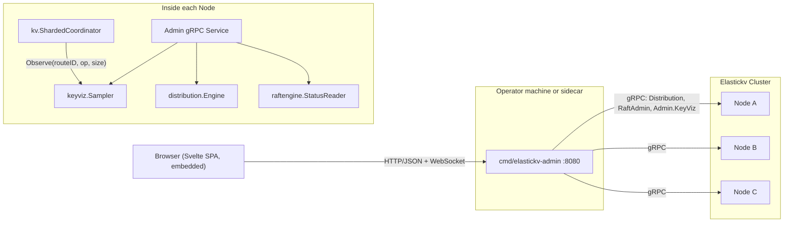

# Admin UI and Key Visualizer Design for Elastickv

## 1. Background

Elastickv currently exposes four data-plane surfaces (gRPC `RawKV`/`TransactionalKV`, Redis, DynamoDB, S3) and one control-plane surface (`Distribution.ListRoutes`, `SplitRange`). Operational insight is provided today by:

- Prometheus metrics on `--metricsAddress` (default `:9090`), backed by `monitoring.Registry` (`monitoring/registry.go:12`).
- Pre-built Grafana dashboards under `monitoring/grafana/`.
- `grpcurl` against the `Distribution` and `RaftAdmin` services.
- `cmd/raftadmin` and `cmd/client` CLIs.

There is no first-party Web UI, and — critically — no per-key or per-route traffic signal. Operators cannot answer questions such as "which key range is hot right now?", "is the load skewed across Raft groups?", or "did the last `SplitRange` actually relieve the hotspot?" without building ad-hoc Prometheus queries, and even those queries cannot drill below the Raft-group aggregate.

This document proposes a built-in admin Web UI, shipped as a separate binary `cmd/elastickv-admin`, and a TiKV-style **Key Visualizer** that renders a time × key-range heatmap of load. The design reuses existing control-plane gRPC APIs (routes, Raft status) and adds a minimal, hot-path-safe sampler for per-route traffic. The initial milestones intentionally avoid depending on the Prometheus client library so that the admin binary remains independently buildable and shippable.

## 2. Goals and Non-goals

### 2.1 Goals

1. Ship a standalone admin binary `cmd/elastickv-admin` that connects to one or more elastickv nodes over gRPC and serves a Web UI.
2. Provide a single UI that covers cluster overview, routes, Raft groups, adapter throughput, and the key visualizer.
3. Produce a time × key-space heatmap with at least four switchable series: read count, write count, read bytes, write bytes.
4. Follow hotspot shards across `SplitRange` / merge events so the heatmap stays continuous.
5. Keep the sampler's hot-path overhead within the measurement noise floor of `BenchmarkCoordinatorDispatch`. Accuracy is expressed as a bound on the **estimator's relative error**, not a raw capture rate (see §5.2).
6. Stay off the Prometheus client library in Phases 0–3. Traffic counters used by the UI are maintained by the in-process sampler and a small adapter-side aggregator that already exists on the hot path.
7. Make the admin binary easy to deploy: a single Go binary with the SPA embedded via `go:embed`, producing one artifact per platform in CI.
8. Protect the node-side `Admin` gRPC service from Phase 0. The UI may bind to localhost, but the nodes expose metadata on their data-plane gRPC port, so read-only admin RPCs require an operator token by default.

### 2.2 Non-goals

1. Replacement of the existing Grafana dashboards. The admin UI focuses on cluster state and the keyspace view; long-horizon trend analysis remains a Prometheus/Grafana concern.
2. Per-individual-key statistics. The visualizer operates on route-level buckets, not on a `GET` / `PUT` trace.
3. Full multi-user RBAC, identity federation, or browser login flows. Phase 0 only requires a shared read-only admin token for the node-side gRPC service; richer auth remains deferred.
4. Query console (SQL/Redis/DynamoDB REPL) inside the UI. Deferred.
5. Multi-cluster federation. Scope is a single cluster; the admin binary may target any single node.

## 3. High-level Architecture



The admin binary holds no authoritative state. All data is fetched on demand from nodes via a new `Admin` gRPC service. The sampler's ring buffer lives inside each node's process, rebuildable after restart once Phase 3 persistence is enabled (see §5.6).

### 3.1 Why a separate binary

- Release cadence for the UI is decoupled from the data plane.
- The admin binary can be placed on an operator workstation or a sidecar pod, so a compromised UI does not imply a compromised data node.
- Node binaries remain free of the Prometheus client (goal §2.1-6) and of any SPA assets.
- `cmd/elastickv-admin --nodes=host:50051 --nodeTokenFile=/etc/elastickv/admin.token` is the full invocation; no multi-file config bundle is required for the default use case.

## 4. API Surface

Two layers:

**Layer A — gRPC, node → admin binary.** A new `Admin` service on each node, registered on the same gRPC port as `RawKV` (`--address`, default `:50051`). All methods are read-only in Phases 0–3 and require `authorization: Bearer <admin-token>` metadata. Nodes load the token from `--adminTokenFile`; the admin binary sends it from `--nodeTokenFile`. An explicit `--adminInsecureNoAuth` flag exists only for local development and logs a warning at startup.

| RPC | Purpose |
|---|---|
| `GetClusterOverview` | Node identity, Raft leader map per group, aggregate QPS |
| `ListRoutes` | Existing `Distribution.ListRoutes` (reused, not duplicated) |
| `GetRaftGroups` | Per-group state (leader, term, commit/applied, last contact) |
| `GetAdapterSummary` | Per-adapter QPS and latency quantiles from the in-process aggregator |
| `GetKeyVizMatrix` | Heatmap matrix for **this node's locally observed samples**: leader writes plus reads served locally, including follower-local reads (see §5.1). The admin binary fans out and merges. |
| `GetRouteDetail` | Time series for one route or virtual bucket (drill-down). The admin binary fans out because reads may be observed by followers. |
| `StreamEvents` | Server-stream of route-state transitions and fresh matrix columns |

**Layer B — HTTP/JSON, browser → admin binary.** Thin pass-through wrappers over the gRPC calls, plus static asset serving.

| Method | Path | Purpose |
|---|---|---|
| GET | `/` (and `/assets/*`) | Embedded SPA |
| GET | `/api/cluster/overview` | Wraps `GetClusterOverview` |
| GET | `/api/routes` | Wraps `ListRoutes` + derived size/leader |
| GET | `/api/raft/groups` | Wraps `GetRaftGroups` |
| GET | `/api/adapters/summary` | Wraps `GetAdapterSummary` |
| GET | `/api/keyviz/matrix` | Wraps `GetKeyVizMatrix` |
| GET | `/api/keyviz/buckets/{bucketID}` | Wraps `GetRouteDetail` for a real route bucket or coarsened virtual bucket |
| WS  | `/api/stream` | Multiplexes `StreamEvents` from all targeted nodes |

HTTP errors use a minimal `{code, message}` envelope. No caching headers on read endpoints.

### 4.1 `GetKeyVizMatrix` parameters

| Field | Type | Default | Notes |
|---|---|---|---|
| `series` | enum(`reads`,`writes`,`readBytes`,`writeBytes`) | `writes` | Selects which counter is returned |
| `from` | timestamp | now−1h | Inclusive |
| `to` | timestamp | now | Exclusive |
| `rows` | int | 256 | Target Y-axis resolution (server may return fewer) |

Response matrix format: `matrix[i][j]` is the value for bucket `i` at time column `j`. Keys in `start`/`end` are raw bytes; the server supplies `label` as a printable preview (§5.6). Each row also carries bucket metadata:

| Field | Meaning |
|---|---|
| `bucketID` | Stable UI identifier, either `route:<routeID>` or `virtual:<lineageID-or-range-hash>`. |
| `aggregate` | `true` when multiple routes were coarsened into this row. |
| `routeIDs` / `routeCount` | Exact route IDs for small aggregates, plus total count. Large aggregates may truncate `routeIDs` and set `routeIDsTruncated=true`. |
| `sampleRoles` | Which roles contributed: `leaderWrite`, `leaderRead`, `followerRead`. |
| `lineageID` | Present for persisted Phase 3 rows so the UI can track continuity across split/merge events. |

## 5. Key Visualizer

### 5.1 Sampling point

A single call site is added at the dispatch entry of `kv.ShardedCoordinator` (see `kv/sharded_coordinator.go`), immediately after the request is resolved to a `RouteID`:

```go
sampler.Observe(routeID, op, keyLen, valueLen)
```

`sampler` is an interface; the default implementation is nil-safe (a nil sampler compiles to one branch and no allocation). The hook runs *before* Raft proposal so it measures offered load, not applied load.

Writes are sampled exactly once by the current Raft leader before proposal. Reads are sampled by the node that actually serves the read: leader reads are marked `leaderRead`, and lease/follower-local reads are marked `followerRead`. Requests forwarded between nodes carry an internal "already sampled" marker so a logical operation is not counted twice. Because read load can be spread across followers, a cluster-wide heatmap requires the admin binary to fan out and merge across nodes (§9.1) — pointing at a single node would produce a partial view.

**Leadership loss.** Each sample carries the `(raftGroupID, leaderTerm)` under which it was recorded. When the node's lease-loss callback fires for a group, the sampler stamps all `leaderWrite` samples for that group in the current and previous step window with `staleLeader=true` rather than deleting them — keeping them visible on the heatmap helps operators diagnose rapid leadership churn, and they remain authoritative for the window in which this node was in fact the leader. The admin fan-out (§9.1) merges writes by `(bucketID, raftGroupID, leaderTerm, windowStart)`, so the stale samples from an old leader and the fresh samples from a new leader never double-count: distinct terms are summed (each term's leader only saw its own term's writes), and within a single term the one leader's samples are authoritative. If fan-out receives `staleLeader=true` samples that conflict with a concurrent newer-term sample for the same window, the cell is flagged `conflict=true` and rendered hatched.

The hot path uses lock-free reads for route lookup and counter increments. The data structures used are:

- **Current-window counters**: `routes` is an immutable `routeTable` published through `atomic.Pointer[routeTable]`. `routeTable` owns `map[RouteID]*routeSlot`; each `routeSlot` owns an `atomic.Pointer[routeCounters]`. `Observe` loads the current table, performs a plain map lookup against that immutable snapshot, loads the slot's counter pointer, and uses `atomic.AddUint64` on the counter fields. Adding a new `RouteID` or replacing split/merge mappings performs a copy-on-write table update under a non-hot-path `routesMu`, then publishes the new table with one atomic store. No `Observe` call ever runs against a Go map that can be mutated concurrently.
- **Flush**: instead of holding a long write lock, the flush goroutine **atomically swaps** the `*routeCounters` pointer for each key using `atomic.Pointer[routeCounters]`, then reads the old pointer's frozen counters to build the new matrix column. `Observe` that loaded the old pointer before the swap completes its increments against the (now-retired) old counters, which the next flush will harvest. No counts are lost; at most one step-boundary's worth of counts land in the next column instead of the current one.
- **Split/merge** (§5.4): the route-watch callback creates the new child slots and publishes a new immutable `routeTable` *before* the `distribution.Engine` exposes the new `RouteID` to the coordinator, so by the time `Observe` sees the new `RouteID` the counter already exists and the callback does not race with the hot path.

### 5.2 Adaptive sub-sampling and the accuracy SLO

Observing every call is cheap but not free. To stay under the benchmark noise floor at very high per-route QPS, the sampler may sub-sample via **adaptive 1-in-N per route**. Counters remain unbiased estimators because each accepted sample increments by `sampleRate`.

The capture rate itself is not the SLO — at `sampleRate = 8` the raw capture rate is 12.5%, but the estimator is still unbiased. What the UI cares about is the **relative error of the bucket total** shown in the heatmap. The SLO is therefore:

> For every bucket displayed in the response, the estimated total is within **±5% of the true value with 95% confidence**, over the bucket's full step window (default 60 s).

For Poisson-ish traffic, the relative error of the Horvitz–Thompson estimator is approximately `1 / sqrt(acceptedSamples)` for 1-in-N sub-sampling where N > 1. Setting this ≤0.05 at 95% CI gives a required `acceptedSamples ≥ (1.96 / 0.05)² ≈ 1537`, independent of the current 1-in-N rate. Buckets sampled at `sampleRate = 1` are exact and do not need the bound. The adaptive controller enforces this by never raising `sampleRate` past the point where the most recent window's `acceptedSamples` falls below that bound; if a burst violates the bound the affected buckets are flagged in the response and the UI renders them hatched so the operator knows the estimate is soft.

`sampleRate` only rises at all when the previous flush window's estimated `Observe` cost crosses a measured threshold. To avoid adding profiling overhead to the hot path, the cost is estimated with a **synthetic model** (no runtime profiler involved): at startup `BenchmarkCoordinatorDispatch` with the sampler enabled records `costPerObserveNs` once, and each flush window computes `estimatedObserveCPU = Σ_routes(observeCount × costPerObserveNs)` directly from the counters already being harvested. This is exact up to the benchmarked cost constant and zero-overhead at runtime. In steady state with moderate per-route QPS, `sampleRate` stays at 1 and every op is counted.

Benchmark gate in CI: `BenchmarkCoordinatorDispatch` with sampler off vs on; the delta must stay within run-to-run variance. Separately, a correctness test drives a known synthetic workload through a sub-sampling sampler and asserts the ±5% / 95%-CI bound holds across 1000 trials.

### 5.3 In-memory representation and the route budget

```text
Sampler
 ├─ routes atomic.Pointer[routeTable]   // immutable map[RouteID]*routeSlot, COW-updated off the hot path
 │     each routeSlot points to         (reads, writes, readBytes, writeBytes, sampleRate)
 └─ history *ringBuffer[matrixColumn]   // one column per stepSeconds (default 60s)
```

Every `stepSeconds` a flush goroutine swaps each route's counter pointer (§5.1) and drops a new column into the ring buffer.

**Route budget and memory cap.** Naïve sizing (`columns × routes × series × 8B`) does not scale: 1 M routes × 1440 columns × 4 series × 8 B = ~46 GiB. Unbounded growth is unacceptable. The sampler enforces a hard budget on tracked routes:

- A new flag `--keyvizMaxTrackedRoutes` (default **10 000** per node) caps the size of `routes`.
- When `ListRoutes` exceeds the cap, the sampler **coarsens adjacent routes into virtual tracking buckets** sized to fit the budget. The admin binary still sees real `RouteID`s in `ListRoutes`, but their `Observe` calls land in the shared bucket. The matrix response never pretends that such a row is a single route: it sets `aggregate=true`, returns a `virtual:*` `bucketID`, includes `routeCount` and the constituent `routeIDs` when small enough, and labels the range `[start-of-first, end-of-last)`.
- Coarsening is greedy on sorted `start` with merge priority given to **lowest recent activity**, so hot routes stay 1:1 until the budget is exhausted.
- Compacted storage: columns older than 1 hour are re-bucketed into 5-minute aggregates, and columns older than 6 hours into 1-hour aggregates. The resulting steady-state footprint is:

| Tracked routes | Ring-buffer retention | Footprint (4 series × 8 B) |
|---|---|---|
| 10 000 (default cap) | 24 h (1440 × 60 s) | ~1.8 GiB raw, **~120 MiB** after tiered compaction |
| 10 000 | 1 h only | **~18 MiB** |
| 1 000 | 24 h compacted | ~12 MiB |

If an operator needs higher fidelity across more routes than the cap allows, they raise `--keyvizMaxTrackedRoutes` knowingly; the log emits an `INFO` at startup stating the selected cap and projected memory. If the cap is hit at runtime, an `INFO` fires once per hour naming which adjacent routes were coalesced.

### 5.4 Keeping up with splits and merges

`distribution.Engine` already emits a watch stream on route-state transitions. The sampler subscribes and, on a split, copies the parent route's historical column values into both children so the heatmap stays visually continuous across the event. On a merge, child columns are summed into the surviving parent. Current-window updates use the immutable-table, pointer-swap scheme from §5.1: child `routeSlot`s and `routeCounters` are installed in a freshly copied `routeTable` **before** the `distribution.Engine` publishes the new `RouteID` to the coordinator, so `Observe` never dereferences a missing route. Counts that raced a transition are attributed to whichever `RouteID` the coordinator resolved — acceptable because the loss is bounded by a single step window.

### 5.5 Bucketing for the response

The API's `rows` parameter is a *target*, not a guarantee. The server walks the route list in lexicographic order of `start` and greedily merges adjacent routes until the row count fits. Merge priority: lowest total activity across the requested window, so hotspots stay un-merged and visible.

### 5.6 Persistence

Phases 0–2 keep history in memory only. Restart loses the heatmap — acceptable for an MVP and keeps the Raft critical path untouched. Phase 3 changes that contract: persisted lineage records are the source of truth and the sampler rebuilds `RouteID → lineageID` state from them on restart.

Phase 3 persists compacted columns **distributed across the user Raft groups themselves, not the default group**. Concentrating KeyViz writes on the default group would centralise I/O and Raft-log growth onto a single group, creating exactly the kind of hotspot this feature is built to surface. Instead:

- Each compacted KeyViz column is written to the **Raft group that owns its key range**, under a group-local admin namespace `!admin|keyviz|range|<lineageID>|<unix-hour>`; the prefix is not routed through the default group. Phase 3 also adds an explicit system-namespace filter so every user-plane read and timestamp-selection path — `pebbleStore.ScanAt`, `ReverseScanAt`, `GetAt`, `ExistsAt`, and `ShardedCoordinator.maxLatestCommitTS` — ignores `!admin|*` records; point reads that target an `!admin|*` key return `NotFound` as if the key did not exist, so an attacker cannot distinguish "hidden" from "missing". The current `isPebbleMetaKey` exact-match check (`store/lsm_store.go:299`) is widened to a prefix check on `!admin|`, and the same check is applied in `nextScannableUserKey` / `prevScannableUserKey` so internal KeyViz records are skipped during user-plane scans. To prevent the inverse leak, every data-plane adapter (gRPC `RawKV`/`TransactionalKV`, Redis, DynamoDB, S3) rejects user-plane writes — `Put`, `Delete`, transactional mutations, and Redis equivalents — whose key starts with `!admin|`. The check is centralised in `kv.ShardedCoordinator` so adapters cannot forget it; a write attempting an `!admin|*` key returns `InvalidArgument` and is recorded in the audit metric.
- `lineageID` is generated **exactly once, by the Raft leader proposing the split/merge**, as part of the route-transition command itself, and then stored in the Raft log — so every replica reads the same value instead of regenerating it. This avoids violating the repository invariant that persistence timestamps must originate from the Raft leader, not from a node-local clock. The transition HLC used is the **leader-issued HLC stamped onto the `SplitRange`/`MergeRange` Raft proposal** (same HLC that backs OCC decisions), never a node-local snapshot; followers observe the lineageID by replaying the committed command. If the leader retries the proposal (e.g., after a `VerifyLeader` failure), the retry keeps the original lineageID because it is embedded in the command payload; nothing about the lineageID depends on the eventual Raft log index it lands at.
- The UUIDv7 is derived deterministically from the leader-issued HLC plus a stable **proposal ID** that the leader generates before enqueueing the command (128-bit random, embedded in the proposal), not the Raft log index — this is what keeps the ID stable across re-proposals. The 48-bit `unix_ts_ms` field gets the HLC physical part (ms resolution), and the full 16-bit HLC logical counter is packed across `rand_a` (12 bits) and the top nibble of `rand_b` — logical bits `[15:4]` into `rand_a`, logical bits `[3:0]` into the top 4 bits of `rand_b`, so no logical bits are dropped. The remaining 58 bits of `rand_b` are filled from `BLAKE2b-256(raftGroupID || proposalID)` truncated to 58 bits — deterministic across replicas, collision-resistant across transitions, and no runtime RNG dependency after the leader has picked the proposal ID. The lineage record stores `{start, end, routeID, validFromHLC, validToHLC, parentLineageIDs, proposalID}` with `validFromHLC` carrying the full HLC so the reader can re-sort authoritatively; `RouteID` is recorded only as the current routing hint, never as the primary history key.
- Split and merge events append small group-local lineage records under `!admin|keyviz|lineage|<lineageID>` and mark closed branches with `validToHLC` so retention GC can later prune them. On split, both children point back to the parent lineage and inherit the parent's compacted history for continuity. On merge, the survivor records both child lineage IDs and the reader sums overlapping intervals. If a node sees historical rows without a lineage record during an upgrade, the admin reader falls back to overlap on the persisted `[start, end)` range before using `RouteID`.
- On startup, the sampler rebuilds its in-memory `RouteID → lineageID` map by scanning the group-local lineage index for routes currently owned by the node's groups and matching active `[start, end)` ranges from `ListRoutes`. If a route exists without a matching lineage record (legacy data from before Phase 3), **only the current Raft leader proposes a `BackfillLineage` command** — a single-writer Raft entry carrying the leader-issued HLC, a leader-picked proposal ID (same construction as above), and a parent pointer to the best overlapping retained range. Followers observe the record by replaying the committed entry, never by generating it locally. This makes rolling restarts and upgrades preserve historical continuity without letting concurrent replicas race and persist divergent lineage IDs.
- Writes are batched per group on a configurable interval (`--keyvizPersistInterval`, **default 5 min**, max 1 h) and dispatched as a single low-priority Raft proposal per group, keeping the write amplification proportional to the group's own traffic. Hourly was rejected as the default because a node crash between flushes would lose up to one hour of heatmap; 5 min bounds worst-case loss while still amortising Raft cost. As a defence-in-depth against single-point loss, each node also keeps the most recent unflushed window in a small **append-only WAL file** (`<dataDir>/keyviz/wal-<hour>.log`) under the same retention contract, with two hard bounds to keep restart fast: the WAL is **size-capped at `--keyvizWALMaxBytes` (default 64 MiB)** and **checkpointed every `--keyvizPersistInterval`** — when a batch is persisted to Raft, the corresponding WAL prefix is truncated. This caps worst-case replay at one interval's worth of data (at the default, tens of MiB at most), and a target recovery budget of **≤1 s replay time at 1 M ops/s**. If the WAL exceeds its size cap before the next flush — indicating the node is behind on persistence — the sampler drops the oldest records and records a `keyviz_wal_shed_total` metric instead of blocking the hot path. On startup the sampler fast-loads the WAL without running the adaptive controller, then resumes normal operation; readiness is gated on WAL replay completion so rolling upgrades do not route traffic to a node that is still rebuilding state. Operators that want stricter durability set `--keyvizPersistInterval=30s`; those that want faster restart at the cost of more write amplification set a smaller `--keyvizWALMaxBytes`.
- Retention is enforced by a KeyViz-specific GC pass, not by assuming ordinary HLC expiry will delete the latest MVCC version. Phase 3 prefers a **Pebble `CompactionFilter`** that drops expired `!admin|keyviz|*` versions during normal background compactions — this avoids the I/O and CPU cost of an out-of-band scan-and-delete sweep, since the work happens during compactions that would run anyway. As a fallback for store flavours where a CompactionFilter is unavailable, an opt-in maintenance pass tombstones expired column and lineage records using a bounded, time-budgeted scan (default ≤5% of disk read bandwidth). Persistence refuses to enable if neither path is available, avoiding unbounded growth.
- Lineage records are retained while any column in the 7-day retention window references them. The same GC pass prunes closed lineage branches whose `validToHLC` and descendants are older than retention, so frequent split/merge clusters do not accumulate an unbounded lineage tree.
- The admin binary, on a history query, fans out to all groups' leaders (§9.1), reconstructs the range timeline from lineage metadata, and merges returned slices by time × key-range overlap. This keeps a hotspot visually continuous even when its serving `RouteID` changed across a `SplitRange` or merge.
- For coarsened virtual buckets (§5.3), the column is written to the group owning the bucket's **first** constituent route, with a small index entry under `!admin|keyviz|index|<hour>` on the same group so the fan-out reader can discover it. The index entry is the only per-hour write that is shared — but its size is bounded by the route-budget cap, not by total traffic.

This keeps the data-plane Raft-log overhead bounded by per-group load and fails independently when a single group is unavailable.

### 5.7 Key preview labels

Raw keys are binary. The UI needs a printable hint per bucket. Strategy:

1. If all keys in the bucket's `[start, end)` are valid UTF-8 with no control characters, return the common byte prefix truncated to 24 chars.
2. Otherwise, return a hex preview of the common prefix plus `…`.
3. Internal reserved prefixes (`!txn|`, `!dist|*`, `!admin|*`) are labelled explicitly and rendered with a distinct color in the UI, so system traffic is never confused with user traffic.

## 6. Adapter Summary Without Prometheus

The existing `monitoring.Registry` observers record into Prometheus counters/histograms — useful for Grafana, but not readable back without pulling in the Prometheus client library. To keep the admin binary and node binary free of that dependency during Phases 0–3:

- A small sibling struct `monitoring.LiveSummary` is added alongside each observer. It maintains, in parallel with the existing Prometheus writes, an in-process rolling window (10-second buckets, 5-minute history) of request count and latency per adapter and per operation.
- Latency is tracked with a **fixed-bucket log-linear histogram** (256 pre-sized buckets covering 1 µs – 10 s, similar to the Prometheus default schema but owned in-process). Each observation is a single `atomic.AddUint64` on the bucket's counter — no sort, no merge, no locks, predictable nanosecond cost. Quantiles (p50/p95/p99) are interpolated at read time by `GetAdapterSummary`. A t-digest was considered but rejected because its centroid merge cost is not bounded on the hot path and is hard to make concurrent without a lock.
- Count, in-flight, and byte totals are plain `atomic.Uint64`.
- `GetAdapterSummary` reads directly from `LiveSummary`. The Prometheus exposition remains unchanged and untouched.

This adds roughly a dozen integer fields per tracked operation and avoids both the Prometheus dependency and the need to scrape `/metrics` from within the admin binary.

## 7. Frontend

- **Stack**: SvelteKit (static adapter) + TypeScript + Tailwind + ECharts (`heatmap` series).
- **Why Svelte**: smaller bundle (~150 KB gzipped for the full app vs ~350 KB for React + equivalent libs), fewer transitive dependency updates to audit, trivial static build that embeds cleanly with `go:embed`. Selected explicitly to favour maintenance simplicity and deployment size.
- **Layout**: left nav with Overview / Routes / Raft / Adapters / Key Visualizer.
- **Key Visualizer page**:
  - X-axis time, Y-axis route buckets, brush-to-zoom on both axes.
  - Series switcher (reads / writes / readBytes / writeBytes).
  - Range selection opens a drawer with the underlying route list, current leader(s), size, and a link to the Raft group page. For `aggregate=true` rows, the drawer explicitly says the row is a coarsened virtual bucket and lists the constituent routes or the truncated route count.
  - Live mode: a WebSocket push appends a new column every `stepSeconds` without refetching history.
  - Buckets that miss the ±5% / 95%-CI estimator bound are hatched to signal estimation uncertainty.
- **Build**: `web/` at repo root, `pnpm build` output copied to `cmd/elastickv-admin/dist/`, embedded with `//go:embed dist`.
- **Dev flow**: Vite dev server on `:5173` proxies `/api` and `/stream` to a locally running `cmd/elastickv-admin`.

## 8. Integration Points

| File | Change |
|---|---|
| `cmd/elastickv-admin/` (new) | Main, HTTP server, gRPC clients, embedded SPA. |
| `adapter/admin_grpc.go` (new) | Server-side implementation of the `Admin` gRPC service, registered in `main.go`. |
| `proto/admin.proto` (new) | Service definition for `Admin`. |
| `kv/sharded_coordinator.go` | One-line `sampler.Observe(...)` at dispatch entry; `sampler` is `keyviz.Sampler` injected via constructor, nil-safe. Phase 3 also filters `!admin|*` from `maxLatestCommitTS` and rejects user-plane writes (`Put`/`Delete`/transactional mutations) targeting `!admin|*` with `InvalidArgument`, so adapters (gRPC, Redis, DynamoDB, S3) cannot bypass the isolation. |
| `keyviz/` (new) | `Sampler`, adaptive sub-sampler, ring buffer, route-watch subscriber, WAL replay, preview logic, tests. |
| `monitoring/live_summary.go` (new) | Rolling-window adapter counters, hooked into existing observers. |
| `store/lsm_store.go` | Phase 3 widens `isPebbleMetaKey` from exact-match to a prefix check on `!admin|` so `nextScannableUserKey` / `prevScannableUserKey` skip all internal KeyViz records during user-plane scans; adds retention GC (Pebble `CompactionFilter` preferred, time-budgeted maintenance sweep fallback) for expired `!admin|keyviz|*` columns and lineage records. |
| `main.go` | Register token-protected `Admin` gRPC service; wire `keyviz.Sampler` into the coordinator; wire `LiveSummary` into observers; add `--adminTokenFile`, `--adminInsecureNoAuth`, `--keyvizMaxTrackedRoutes`, `--keyvizPersistInterval`, and `--keyvizWALMaxBytes`. |
| `web/` (new) | Svelte SPA source. |

Phases 0–2 require no Raft or FSM changes. Data-plane protocol adapters only receive the sampler call site and the `LiveSummary` hook that sits next to existing Prometheus writes. Phase 3 does change Raft and FSM paths: split/merge Raft commands carry a leader-picked `proposalID` and the derived `lineageID`, a new `BackfillLineage` leader-only command is added for startup recovery, per-group low-priority Raft proposals persist compacted KeyViz columns, and the store/coordinator read paths are updated to keep `!admin|keyviz|*` metadata out of user scans and timestamp selection.

## 9. Deployment and Operation

- The admin binary is not intended to be exposed on the public network in its initial form. Default bind is `127.0.0.1:8080`; browser login and RBAC are deferred, but node-side `Admin` gRPC calls require the shared read-only token from §4.
- Typical operator workflow: `ssh -L 8080:localhost:8080 operator@host` then `elastickv-admin --nodes=host1:50051,host2:50051,host3:50051 --nodeTokenFile=/etc/elastickv/admin.token`, or run the binary on a laptop and point it at any reachable subset of nodes.
- The admin binary is stateless; it can be killed and restarted without coordination.
- CI produces release artifacts for `linux/amd64`, `linux/arm64`, `darwin/arm64`, and `windows/amd64`.

### 9.1 Cluster-wide fan-out

Because writes are recorded by Raft leaders and follower-local reads are recorded by the followers that serve them (§5.1), pointing the admin binary at a single node produces a **partial heatmap**. To give operators a complete view by default, the admin binary runs in **fan-out mode**:

- `--nodes` accepts a comma-separated list of seed addresses. The admin binary calls `GetClusterOverview` on any reachable seed to discover the current full membership (node → gRPC endpoint, plus per-group leader identity). Membership is cached for `--nodesRefreshInterval` (**default 15 s**) so a stampede of concurrent browser requests hits at most one `GetClusterOverview` per interval per seed, while scale-out events are still reflected within seconds. The cache is refreshed lazily on the first request after expiry and invalidated immediately on any per-node `Unavailable` error, so removed or replaced nodes are dropped on the next request instead of waiting for the next tick.
- For each query (`GetKeyVizMatrix`, `GetRouteDetail`, `GetAdapterSummary`), the admin binary issues parallel gRPC calls to every known node and merges results server-side before sending one combined JSON payload to the browser.
- Merging rule for the heatmap: rows are grouped by `bucketID`/`lineageID` and time step. Read samples from multiple nodes are **summed**, because they represent distinct locally served reads. For write samples the authoritative identity is `(raftGroupID, leaderTerm)` — by Raft invariants at most one leader exists per term per group — so the admin binary collapses write samples to **one value per `(bucketID, raftGroupID, leaderTerm, windowStart)`** key. If the same logical key arrives from more than one node (e.g., an ex-leader that has not yet expired its local cache plus a correctly-responding new leader in the same term), the entries are expected to be identical and the merger keeps one; if they differ, the cell is surfaced with `conflict=true` (not silently dropped). Across distinct `leaderTerm` values for the same group and window, values are summed because each term's leader only observed its own term's writes. The admin binary never uses "later timestamp wins" to overwrite a previous leader's complete window with a new leader's partial window.
- Degraded mode: if any node is unreachable, the admin binary returns a partial result with a per-node `{node, ok, error}` status array so the UI can surface "3 of 4 nodes responded" instead of silently hiding ranges. The heatmap hatches rows or time windows whose expected source node failed.
- A single-node mode (`--nodes=one:50051 --no-fanout`) is retained for operators who explicitly want the partial view.

## 10. Performance Considerations

- Sampler fast path on a hit: `atomic.Pointer[routeTable].Load`, immutable map lookup by `RouteID`, `atomic.Pointer[routeCounters].Load`, then `atomic.AddUint64` on the four counters. No allocation per call, no mutex acquisition, no global lock.
- The coordinator already holds the `RouteID` at the hook site, so the sampler does not re-resolve.
- The flush goroutine performs atomic pointer swaps per tracked route; there is no write lock covering `Observe` calls. Splits and merges publish a copied immutable route table with child counters before publishing the new `RouteID` (§5.4), so the callback does not race with the hot path.
- API endpoints cap `to − from` at 7 days and `rows` at 1024 to bound server work.
- `LiveSummary` adds a second atomic increment alongside each existing Prometheus `Inc()`, plus one atomic increment on a fixed-bucket histogram counter. Cost is on the order of a nanosecond and well below the noise floor in §5.2.
- Fan-out cost (§9.1) is N parallel gRPC calls; each node serves only its locally observed samples, so the response size is distributed and the aggregate wall-clock is bounded by the slowest node, not the sum.

## 11. Testing

1. Unit tests for `keyviz.Sampler`: concurrent `Observe` under the `-race` detector while copy-on-write route-table updates run, flush correctness via the pointer-swap protocol, split/merge reshaping, forwarded-read "already sampled" deduplication, and the **accuracy SLO** (1000 trials of synthetic workload must satisfy ±5% relative error at 95% CI per §5.2).
2. Route-budget test: generate more than `--keyvizMaxTrackedRoutes` routes and assert that coarsening preserves total observed traffic, keeps hot routes un-merged, and returns `aggregate`, `bucketID`, `routeCount`, and constituent route metadata correctly.
3. Integration test in `kv/` that drives synthetic traffic through the coordinator and asserts the matrix reflects the skew.
4. gRPC handler tests with a fake engine and fake Raft status reader.
5. Fan-out test: admin binary against a 3-node fake cluster, including follower-local reads, one unreachable node, and a leadership transfer in the middle of a step window; the merged response must sum non-duplicate samples, preserve the partial-status array, and flag ambiguous overlap.
6. Persistence test: write compacted columns to per-range groups, perform split and merge transitions, restart a node, take a leadership transfer, run KeyViz GC, and verify the lineage reader reconstructs complete history across groups without relying on stable `RouteID`s`.
7. Namespace isolation test: user `ScanAt`, `ReverseScanAt`, and `maxLatestCommitTS` must ignore `!admin|keyviz|*` records, and user-plane `Put` / `Delete` / transactional writes to any `!admin|*` key must be rejected with `InvalidArgument` by every adapter (gRPC `RawKV`/`TransactionalKV`, Redis, DynamoDB, S3).
8. Auth test: `Admin` gRPC methods reject missing or wrong tokens and accept the configured read-only token.
9. Benchmark gate: `BenchmarkCoordinatorDispatch` with sampler off vs on. CI fails if the difference exceeds the benchmark's own run-to-run variance.
10. Playwright smoke test against the embedded SPA to catch build-time regressions.

## 12. Phased Delivery

| Phase | Scope | Exit criteria |
|---|---|---|
| 0 | `cmd/elastickv-admin` skeleton, token-protected `Admin` gRPC service stub, empty SPA shell, CI wiring. | Binary builds, `/api/cluster/overview` returns live data from a real node only when the configured admin token is supplied. |
| 1 | Overview, Routes, Raft Groups, Adapters pages. `LiveSummary` added. No sampler. | All read-only pages match `grpcurl` ground truth. |
| 2 | Key Visualizer MVP: in-memory sampler with adaptive sub-sampling, leader writes, leader/follower reads, fan-out across nodes, static matrix API with virtual-bucket metadata. | Benchmark gate green; heatmap shows synthetic hotspot within 2 s of load; ±5% / 95%-CI accuracy SLO holds under synthetic bursts; fan-out returns complete view with 1 node down. |
| 3 | Bytes series, drill-down, split/merge continuity, namespace-isolated persistence of compacted columns distributed **per owning Raft group**, lineage recovery, and retention GC. | Heatmap remains continuous across a live `SplitRange`; restart preserves last 7 days; expired data and stale lineage records are collected; no single Raft group sees more than its share of KeyViz writes. |
| 4 (deferred) | Mutating admin operations (`SplitRange` from UI), browser login, RBAC, and identity-provider integration. Out of scope for this design; a follow-up design will cover it. | — |

Phases 0–2 are the minimum operationally useful product; Phase 3 is the "ship-quality" target.

## 13. Open Questions

1. Default value of `--keyvizMaxTrackedRoutes`. 10 000 is conservative; operators with very large clusters may prefer a higher default paired with shorter retention. Settle during Phase 2 benchmarking.
2. For the Phase 3 persistence schema, should KeyViz writes share a transaction with other per-group low-priority maintenance (compaction metadata, etc.) to amortise Raft cost, or remain a dedicated batch for easier rollback?
