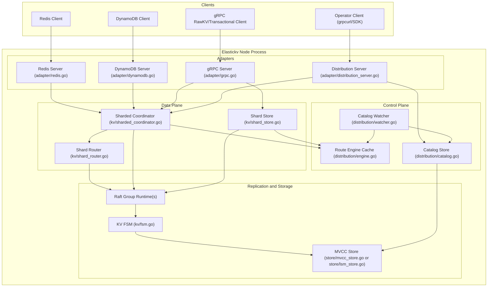
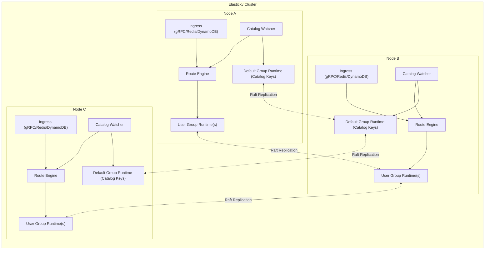
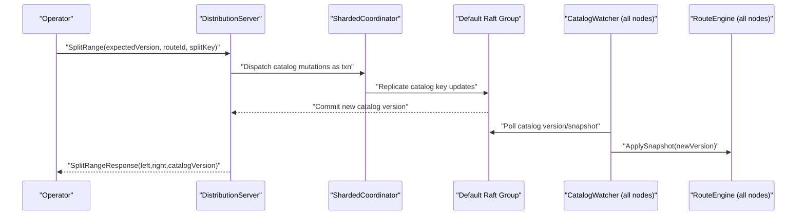

# Elastickv Architecture Overview

This document summarizes the current architecture and runtime topology.

## 1. Component Diagram

## 2. Overall Runtime Architecture

## 3. Control Plane Split Path (Milestone 1)

## 4. Notes

1. Route catalog is persisted in reserved internal keys in the default Raft group.
2. `distribution.Engine` is an in-memory read path cache and is refreshed by watcher.
3. Milestone 1 split is same-group only. Cross-group migration is out of scope.
