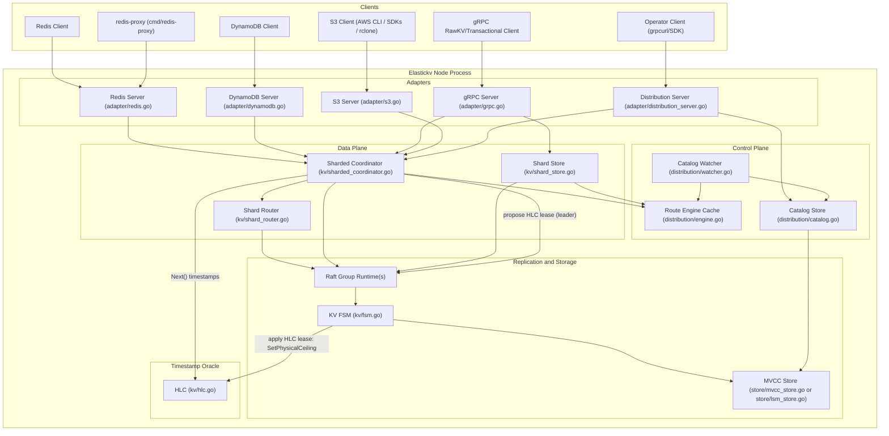
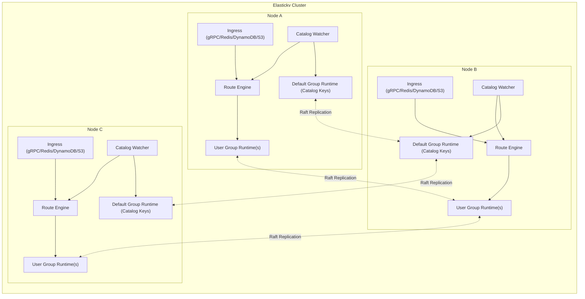
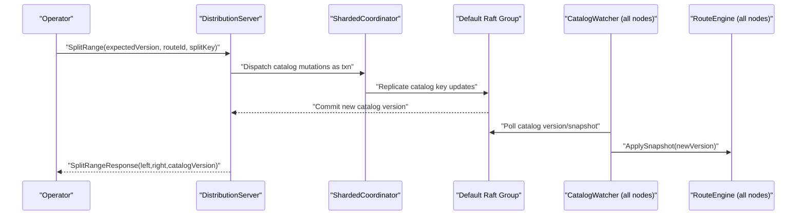
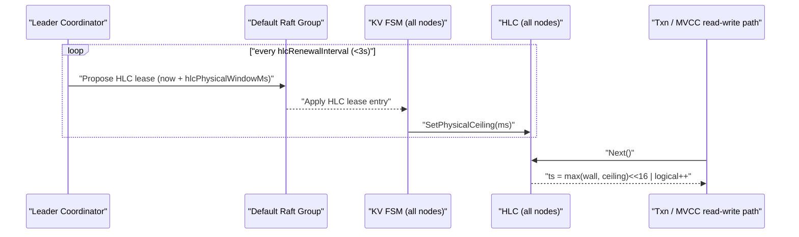

# Elastickv Architecture Overview

This document summarizes the current architecture and runtime topology.

## 1. Component Diagram

```mermaid
flowchart TB
  subgraph Clients["Clients"]
    RC["Redis Client"]
    DC["DynamoDB Client"]
    GC["gRPC RawKV/Transactional Client"]
    OC["Operator Client (grpcurl/SDK)"]
    SC["S3 Client (AWS CLI / SDKs / rclone)"]
    RP["redis-proxy (cmd/redis-proxy)"]
  end

  subgraph Node["Elastickv Node Process"]
    subgraph Adapters["Adapters"]
      RS["Redis Server (adapter/redis.go)"]
      DBS["DynamoDB Server (adapter/dynamodb.go)"]
      GS["gRPC Server (adapter/grpc.go)"]
      DS["Distribution Server (adapter/distribution_server.go)"]
      S3S["S3 Server (adapter/s3.go)"]
    end

    subgraph DataPlane["Data Plane"]
      SCC["Sharded Coordinator (kv/sharded_coordinator.go)"]
      SS["Shard Store (kv/shard_store.go)"]
      SR["Shard Router (kv/shard_router.go)"]
    end

    subgraph ControlPlane["Control Plane"]
      DE["Route Engine Cache (distribution/engine.go)"]
      CW["Catalog Watcher (distribution/watcher.go)"]
      CS["Catalog Store (distribution/catalog.go)"]
    end

    subgraph Replication["Replication and Storage"]
      RG["Raft Group Runtime(s)"]
      FSM["KV FSM (kv/fsm.go)"]
      MV["MVCC Store (store/mvcc_store.go or store/lsm_store.go)"]
    end

    subgraph Clock["Timestamp Oracle"]
      HLC["HLC (kv/hlc.go)"]
    end
  end

  RC --> RS
  DC --> DBS
  GC --> GS
  OC --> DS
  SC --> S3S
  RP --> RS

  RS --> SCC
  DBS --> SCC
  GS --> SCC
  GS --> SS
  S3S --> SCC
  SCC --> SR
  SCC --> DE
  SS --> DE

  DS --> SCC
  DS --> CS

  SR --> RG
  SCC --> RG
  SS --> RG
  RG --> FSM
  FSM --> MV

  CS --> MV
  CW --> CS
  CW --> DE

  SCC -- "Next() timestamps" --> HLC
  FSM -- "apply HLC lease: SetPhysicalCeiling" --> HLC
  SCC -- "propose HLC lease (leader)" --> RG
```

## 2. Overall Runtime Architecture

```mermaid
flowchart LR
  subgraph Cluster["Elastickv Cluster"]
    subgraph N1["Node A"]
      AIN["Ingress (gRPC/Redis/DynamoDB/S3)"]
      ADE["Route Engine"]
      ACW["Catalog Watcher"]
      ARG0["Default Group Runtime (Catalog Keys)"]
      ARG1["User Group Runtime(s)"]
    end

    subgraph N2["Node B"]
      BIN["Ingress (gRPC/Redis/DynamoDB/S3)"]
      BDE["Route Engine"]
      BCW["Catalog Watcher"]
      BRG0["Default Group Runtime (Catalog Keys)"]
      BRG1["User Group Runtime(s)"]
    end

    subgraph N3["Node C"]
      CIN["Ingress (gRPC/Redis/DynamoDB/S3)"]
      CDE["Route Engine"]
      CCW["Catalog Watcher"]
      CRG0["Default Group Runtime (Catalog Keys)"]
      CRG1["User Group Runtime(s)"]
    end
  end

  AIN --> ADE
  BIN --> BDE
  CIN --> CDE

  ADE --> ARG1
  BDE --> BRG1
  CDE --> CRG1

  ARG0 <-. "Raft Replication" .-> BRG0
  BRG0 <-. "Raft Replication" .-> CRG0

  ARG1 <-. "Raft Replication" .-> BRG1
  BRG1 <-. "Raft Replication" .-> CRG1

  ACW --> ARG0
  BCW --> BRG0
  CCW --> CRG0

  ACW --> ADE
  BCW --> BDE
  CCW --> CDE
```

## 3. Control Plane Split Path (Milestone 1)

```mermaid
sequenceDiagram
  participant Op as "Operator"
  participant DS as "DistributionServer"
  participant SC as "ShardedCoordinator"
  participant DG as "Default Raft Group"
  participant CW as "CatalogWatcher (all nodes)"
  participant DE as "RouteEngine (all nodes)"

  Op->>DS: "SplitRange(expectedVersion, routeId, splitKey)"
  DS->>SC: "Dispatch catalog mutations as txn"
  SC->>DG: "Replicate catalog key updates"
  DG-->>DS: "Commit new catalog version"
  CW->>DG: "Poll catalog version/snapshot"
  CW->>DE: "ApplySnapshot(newVersion)"
  DS-->>Op: "SplitRangeResponse(left,right,catalogVersion)"
```

## 4. Hybrid Logical Clock (HLC)

Transactional reads and writes are ordered by a Hybrid Logical Clock (`kv/hlc.go`).
A 64-bit timestamp packs a 48-bit physical component (Unix milliseconds) and a
16-bit in-memory logical counter. The physical component is bounded by a
Raft-agreed ceiling so that a newly elected leader never issues timestamps that
overlap the previous leader's window.

```mermaid
sequenceDiagram
  participant L as "Leader Coordinator"
  participant RG as "Default Raft Group"
  participant F as "KV FSM (all nodes)"
  participant H as "HLC (all nodes)"
  participant Tx as "Txn / MVCC read-write path"

  loop "every hlcRenewalInterval (<3s)"
    L->>RG: "Propose HLC lease (now + hlcPhysicalWindowMs)"
    RG-->>F: "Apply HLC lease entry"
    F->>H: "SetPhysicalCeiling(ms)"
  end

  Tx->>H: "Next()"
  H-->>Tx: "ts = max(wall, ceiling)<<16 | logical++"
```

## 5. Notes

1. Route catalog is persisted in reserved internal keys in the default Raft group.
2. `distribution.Engine` is an in-memory read path cache and is refreshed by watcher.
3. Milestone 1 split is same-group only. Cross-group migration is out of scope.
4. HLC physical ceiling is replicated via the default Raft group; the logical
   counter advances in memory with no Raft round-trip. Coordinator and FSM share
   the same `*HLC` instance (wired via `WithHLC` / `NewKvFSMWithHLC`).
