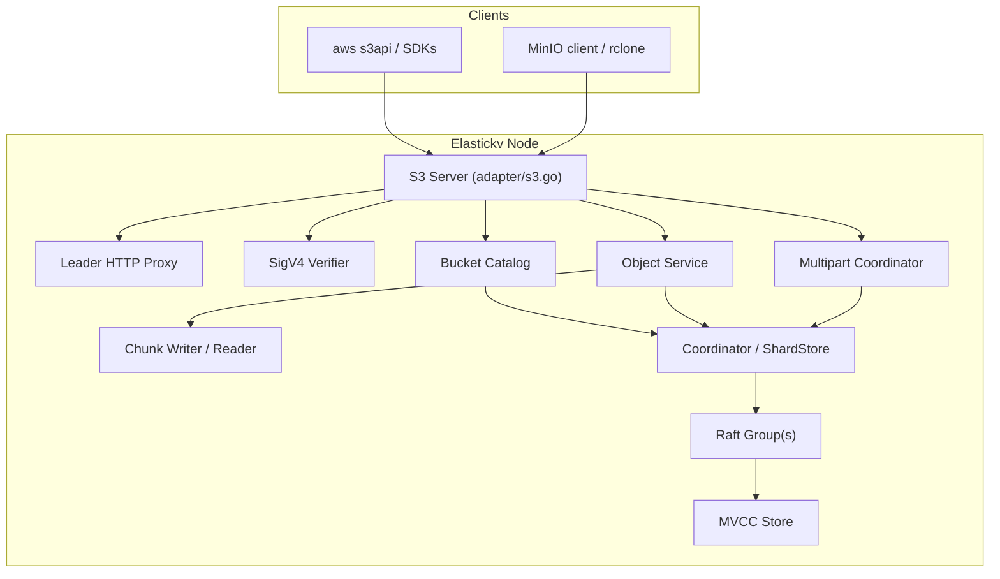
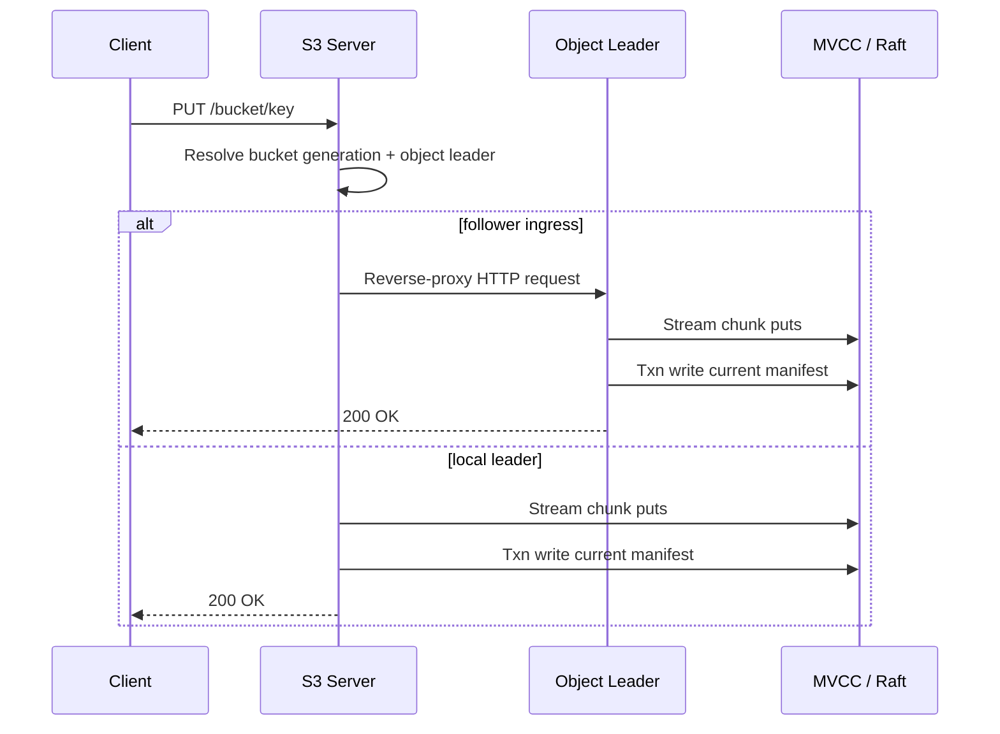

# S3-Compatible Adapter Design for Elastickv

## 1. Background

Elastickv already exposes three protocol surfaces:

1. gRPC (`RawKV` / `TransactionalKV`)
2. Redis-compatible commands
3. DynamoDB-compatible HTTP APIs

As of March 22, 2026, there is no S3-compatible adapter. This document proposes an HTTP adapter that exposes an S3-like object API while reusing the existing Raft, MVCC, HLC, shard-routing, and adapter patterns already present in the repository.

The design goal is S3 compatibility, not full AWS parity. The adapter should be good enough for common SDK and CLI workflows against a self-hosted Elastickv cluster.

## 2. Goals and Non-goals

### 2.1 Goals

1. Add an `adapter/s3.go` HTTP server that fits the existing adapter model.
2. Provide strong read-after-write and list-after-write consistency for the current object view.
3. Support object sizes larger than a single MVCC value by chunking object data.
4. Preserve shard correctness for object metadata, multipart state, and chunk keys.
5. Avoid forwarding large payloads through the current internal gRPC write path.
6. Keep bucket metadata durable and cluster-global.

### 2.2 Non-goals

1. Full AWS S3 feature parity.
2. IAM, STS, bucket policies, or cross-account authorization. (Bucket-level canned ACLs `private`/`public-read` are supported — see `docs/design/2026_04_01_implemented_s3_public_bucket.md`.)
3. Public S3 object versioning APIs in the first milestone.
4. Lifecycle rules, replication, object lock, event notifications, website hosting, or SSE-KMS.
5. Zero-copy `CopyObject` in the first milestone.

## 3. Compatibility Scope

Initial compatibility should focus on the APIs most clients actually need:

| API | Target Phase |
|---|---|
| `ListBuckets` | 1 |
| `CreateBucket` | 1 |
| `HeadBucket` | 1 |
| `DeleteBucket` | 1, only when empty |
| `PutObject` | 1 |
| `GetObject` | 1 |
| `HeadObject` | 1 |
| `DeleteObject` | 1 |
| `ListObjectsV2` | 1 |
| `CreateMultipartUpload` | 2 |
| `UploadPart` | 2 |
| `CompleteMultipartUpload` | 2 |
| `AbortMultipartUpload` | 2 |
| `ListParts` | 2, optional but recommended |
| `PutBucketAcl` | Implemented (`private`, `public-read`) |
| `GetBucketAcl` | Implemented |
| `CopyObject` | 3 |
| Versioning APIs | Later |
| Presigned URLs | 2 |
| Virtual-hosted bucket style | 3; path-style first |

Phase 1 should target path-style requests such as:

```text
PUT /my-bucket/path/to/object.txt
GET /my-bucket/path/to/object.txt
GET /my-bucket?list-type=2&prefix=path/
```

## 4. High-level Architecture

The new adapter sits beside Redis and DynamoDB and reuses the same underlying data plane.



### 4.1 Why an HTTP leader proxy is required

The current internal forwarding path uses gRPC and protobuf request bodies. That works for Redis- and KV-sized payloads, but it is a poor fit for large S3 request and response bodies.

For S3, the adapter should resolve the Raft leader for the target bucket or object before consuming a large body:

1. If the local node is the verified leader for the target route, serve locally.
2. Otherwise reverse-proxy the HTTP request to the leader's S3 endpoint.

This is the same basic idea as `adapter/redis_proxy.go`, but it must preserve the original S3 headers and stream the request body instead of rebuilding it as an internal RPC.

## 5. Data Model

### 5.1 Bucket catalog

Bucket metadata should live in a reserved control-plane keyspace, stored in the default Raft group, similar to the durable route catalog in `distribution/`.

Suggested keys:

1. `!s3|bucket|meta|<bucket>` -> bucket metadata record
2. `!s3|bucket|gen|<bucket>` -> monotonically increasing generation counter

Suggested bucket metadata fields:

1. `bucket_name`
2. `generation`
3. `created_at_hlc`
4. `owner`
5. `region`
6. `flags` such as versioning-enabled later

The generation field prevents stale multipart state or garbage-collection work from a deleted bucket name from affecting a later bucket recreated with the same name.

### 5.2 Object and multipart keyspace

Object data should be split between a small manifest and many immutable blob chunks.

Suggested keys:

1. `!s3|obj|head|<bucket-esc><gen-u64><object-esc>` -> current object manifest
2. `!s3|upload|meta|<bucket-esc><gen-u64><object-esc><upload-id-esc>` -> multipart upload metadata
3. `!s3|upload|part|<bucket-esc><gen-u64><object-esc><upload-id-esc><part-no-u64>` -> uploaded part descriptor
4. `!s3|blob|<bucket-esc><gen-u64><object-esc><upload-id-esc><part-no-u64><chunk-no-u64>` -> immutable chunk bytes
5. `!s3|gc|upload|<bucket-esc><gen-u64><object-esc><upload-id-esc>` -> async cleanup marker

Segment encoding:

- All string segments (`<bucket-esc>`, `<object-esc>`, `<upload-id-esc>`) MUST use the same prefix-safe, byte-ordered escaping scheme as the DynamoDB adapter’s key encoder (`encodeDynamoKeySegment`). Concretely: the escape byte is `0x00`; any raw `0x00` byte in the segment payload is encoded as the two-byte sequence `0x00 0xFF`; the segment is terminated by the two-byte sequence `0x00 0x01`. This makes each string segment self-delimiting while preserving lexicographic order over the original strings.
- All numeric segments (`<gen-u64>`, `<part-no-u64>`, `<chunk-no-u64>`) MUST be encoded as fixed-width 8-byte big-endian unsigned integers (ordered uint64) written directly after the preceding segment, with no additional separator bytes.
- The layout is therefore:
  - `obj|head`: `prefix | bucket-esc | gen-u64 | object-esc`
  - `upload|meta`: `prefix | bucket-esc | gen-u64 | object-esc | upload-id-esc`
  - `upload|part`: `prefix | bucket-esc | gen-u64 | object-esc | upload-id-esc | part-no-u64`
  - `blob`: `prefix | bucket-esc | gen-u64 | object-esc | upload-id-esc | part-no-u64 | chunk-no-u64`
  - `gc|upload`: `prefix | bucket-esc | gen-u64 | object-esc | upload-id-esc`

Parsing proceeds by decoding each escaped string segment until its terminator byte, then reading the next fixed 8 bytes for any numeric segment in that position. Because escaped segments are prefix-free and numeric segments are fixed-width big-endian, these keys are unambiguous to parse and preserve the intended byte-sort order over bucket, generation, object name, upload id, part number, and chunk number.
### 5.3 Manifest format

The current object manifest should remain small and should be optimized for `HEAD`, `GET`, and `LIST`.

Suggested manifest fields:

1. `upload_id`
2. `etag`
3. `size_bytes`
4. `last_modified_hlc`
5. `content_type`
6. `content_encoding`
7. `cache_control`
8. `content_disposition`
9. `user_metadata`
10. `parts[]`

Each manifest part entry should include:

1. `part_no`
2. `etag`
3. `size_bytes`
4. `chunk_count`
5. `chunk_sizes[]`

The chunk keys remain immutable. The manifest is the only key that makes an upload visible to readers.

### 5.4 ETag computation

ETags must match the format used by Amazon S3 so that clients and SDKs can use them for integrity checks and conditional requests.

**Single-part uploads (`PutObject`):**

The ETag is the lowercase hex-encoded MD5 hash of the complete object body:

```
ETag = hex(md5(object_body))
```

Example: `"d41d8cd98f00b204e9800998ecf8427e"` (MD5 of empty body).

**Multipart uploads (`CompleteMultipartUpload`):**

The ETag is the lowercase hex-encoded MD5 hash of the binary concatenation of the MD5 hash of each part (in part-number order), followed by a hyphen and the total number of parts:

```
ETag = hex(md5(md5_bytes(part_1) || md5_bytes(part_2) || ... || md5_bytes(part_N))) + "-N"
```

where `md5_bytes(part_i)` is the raw 16-byte MD5 digest of part `i`'s body and `N` is the number of parts.

Example with 3 parts: `"abc123...-3"`.

Per-part ETags stored in each part descriptor must use the single-part format (MD5 of the part body). `CompleteMultipartUpload` validates that the caller-supplied per-part ETags match the stored part descriptors before committing the manifest.

## 6. Routing Model

### 6.1 Logical route key

All object-scoped internal keys must route as if they belong to the logical object key:

```text
!s3route|<bucket-esc><gen-u64><object-esc>
```

That means:

1. `!s3|obj|head|...`
2. `!s3|upload|meta|...`
3. `!s3|upload|part|...`
4. `!s3|blob|...`
5. `!s3|gc|upload|...`

must all normalize to the same logical route key.

### 6.2 Required core changes

Two existing core paths need to be generalized for S3:

1. The `routeKey(...)` function must recognize S3 internal prefixes, similar to how it already normalizes Redis internal keys and list keys.
2. `kv/ShardStore.routesForScan` must gain an S3-aware internal scan mapping so `ListObjectsV2` can scan object manifests across shards using logical object ranges instead of raw `!s3|...` key order.

Without these changes, object metadata writes may be routed correctly while object listings still scan the wrong shard ranges.

## 7. Request Flows

### 7.1 `PutObject`

`PutObject` should use a manifest-last write path:



Detailed steps:

1. Read bucket metadata and generation.
2. Resolve leader for the logical object key.
3. If local node is not the verified leader, reverse-proxy the HTTP request.
4. Stream the body into chunk writes under a fresh hidden `upload_id`.
5. Compute `ETag` (hex-encoded MD5 of the full object body), length, and header-derived metadata while streaming.
6. Finalize with a small OCC transaction that writes the new manifest and optional GC marker for the previous `upload_id`.
7. Return success only after the manifest commit is durable.

The key property is that chunk writes are not visible until the manifest is committed.

### 7.2 `GetObject` and `HeadObject`

`GetObject` and `HeadObject` read a single manifest at one snapshot timestamp, then stream the referenced chunks at the same snapshot timestamp.

This gives:

1. Read-after-write consistency for the current object view.
2. A stable object body during the request even if a concurrent overwrite commits later.

Large object reads should also use the HTTP leader proxy instead of the small-object gRPC read path.

### 7.3 `ListObjectsV2`

`ListObjectsV2` should scan only manifest keys, never chunk keys.

Algorithm:

1. Resolve bucket generation.
2. Capture one `readTS` using the adapter's clock/store snapshot helper.
3. Scan manifest keys under the bucket prefix at `readTS`.
4. Apply `prefix`, `delimiter`, `max-keys`, and continuation-token logic in memory.
5. Return keys ordered by encoded object key.

Continuation tokens should encode at least:

1. bucket
2. generation
3. prefix
4. delimiter
5. last returned object key
6. optional `readTS`

Including `readTS` gives repeatable paging across a changing bucket, at the cost of possible expiration if old snapshots are compacted later.

### 7.4 Multipart upload

Multipart uploads should reuse the same storage model instead of inventing a separate final-object format.

1. `CreateMultipartUpload` writes upload metadata and returns `upload_id`.
2. `UploadPart` streams blobs into `!s3|blob|...<upload-id>...` and writes or overwrites the part descriptor.
3. `CompleteMultipartUpload` reads all referenced part descriptors at one `readTS`, validates ETags and order, then writes the current manifest in one OCC transaction.
4. `AbortMultipartUpload` tombstones the upload metadata and schedules async cleanup.

The completed object can keep using the same `upload_id` as its internal storage identifier. No rename is required.

## 8. Consistency Model

### 8.1 Current-object consistency

The adapter should expose strong consistency for the current object state:

1. `PUT` followed by `GET` sees the new object.
2. `PUT` followed by `LIST` sees the new key.
3. `DELETE` followed by `GET` returns not found.
4. `DELETE` followed by `LIST` hides the key.

This maps naturally to the current manifest key because visibility is controlled by one small MVCC record.

### 8.2 Conditional requests

The adapter should evaluate `If-Match`, `If-None-Match`, and overwrite races against the current manifest, then finalize with an OCC transaction whose `StartTS` is the manifest read timestamp.

That uses existing MVCC conflict detection to reject finalization if the object changed while a large upload was in progress.

### 8.3 What is intentionally not exposed

Elastickv already stores multiple MVCC versions internally, but Milestone 1 should not expose them as S3 version IDs. Public S3 versioning introduces different semantics for delete markers, listing, retention, and restore behavior and should be treated as a later feature.

## 9. Authentication and Authorization

Milestone 1 should support a narrow, explicit security model:

1. AWS Signature Version 4 request signing
2. Static access-key and secret-key pairs from local configuration
3. Optional fixed region from server configuration
4. Bucket-level canned ACLs (`private`, `public-read`) via `PutBucketAcl` / `GetBucketAcl` and `x-amz-acl` header on `CreateBucket`. Public buckets allow anonymous read access (GetObject, HeadObject, ListObjectsV2) while write operations always require authentication. See `docs/design/2026_04_01_implemented_s3_public_bucket.md` for details.

Not in scope for Milestone 1:

1. IAM policies
2. Object-level ACLs or bucket policies (JSON)
3. Temporary credentials

The server should reject headers and APIs that imply unsupported policy behavior instead of silently pretending to support them.

## 10. Failure Handling and Cleanup

The manifest-last design creates safe but potentially orphaned data after failures:

1. If chunk writes succeed but manifest commit fails, the new upload is invisible and can be garbage-collected later.
2. If multipart parts are uploaded but never completed, upload metadata and part/chunk data become abandoned and must be cleaned up.
3. If an overwrite succeeds, the previous `upload_id` can be reclaimed asynchronously after a grace period.

Recommended cleanup model:

1. Write explicit GC markers during overwrite or abort flows.
2. Run a background reaper that scans GC markers and stale multipart uploads.
3. Delete chunk keys and part descriptors in bounded batches.

This is safer than making large object writes depend on immediate inline deletion.

## 11. Operational and Configuration Changes

The server entrypoint will need new S3-specific configuration, for example:

1. `--s3Address`
2. `--raftS3Map`
3. `--s3Region`
4. `--s3CredentialsFile`
5. `--s3PathStyleOnly`

`--raftS3Map` serves the same purpose as `--raftRedisMap`: it lets a follower proxy a request to the correct leader S3 endpoint.

## 12. Observability

The adapter should expose metrics similar to the DynamoDB adapter:

1. request count by API
2. success vs error
3. request and response bytes
4. end-to-end latency
5. streamed object bytes
6. multipart upload counts
7. background cleanup counts and lag
8. proxy-to-leader counts

Structured logs should include:

1. `bucket`
2. `key`
3. `upload_id`
4. `part_no`
5. `etag`
6. `commit_ts`
7. `leader`

## 13. Testing Plan

### 13.1 Unit tests

1. key encoding and routing normalization
2. SigV4 canonical request verification
3. manifest serialization
4. range-read math
5. multipart ETag calculation
6. continuation-token encoding and decoding

### 13.2 Integration tests

1. single-node `PutObject` / `GetObject` / `ListObjectsV2`
2. follower-ingress write proxying to leader
3. overwrite races with OCC conflict detection
4. multipart upload happy path
5. leader failover during multipart upload
6. delete bucket only when empty

### 13.3 Compatibility tests

1. `aws s3api` smoke tests
2. MinIO Go SDK basic object tests
3. `rclone ls`, `copy`, and multipart-sized transfers

## 14. Rollout Plan

### Phase 1

1. Bucket catalog
2. path-style routing
3. `PutObject`, `GetObject`, `HeadObject`, `DeleteObject`
4. `ListBuckets`, `HeadBucket`, `CreateBucket`, `DeleteBucket`
5. `ListObjectsV2`
6. leader HTTP proxy

### Phase 2

1. multipart upload flow
2. range reads
3. `ListParts`
4. presigned URLs

### Phase 3

1. virtual-hosted bucket style
2. zero-copy `CopyObject`
3. optional public versioning support

## 15. Summary

The core design choice is to make the current object manifest the only visible record and to treat all blob chunks as immutable implementation details. That choice fits Elastickv's existing MVCC and OCC model well:

1. large object bodies never need to fit in one MVCC value
2. overwrites remain atomic at the manifest boundary
3. list operations stay cheap because they scan only manifests
4. crash recovery is simple because incomplete uploads are invisible

The two most important repository-level prerequisites are:

1. S3-aware internal-key routing and scan routing in `kv/`
2. an HTTP leader proxy path for large object requests

With those pieces in place, an S3-compatible adapter can be added without changing the fundamental Elastickv storage architecture.
