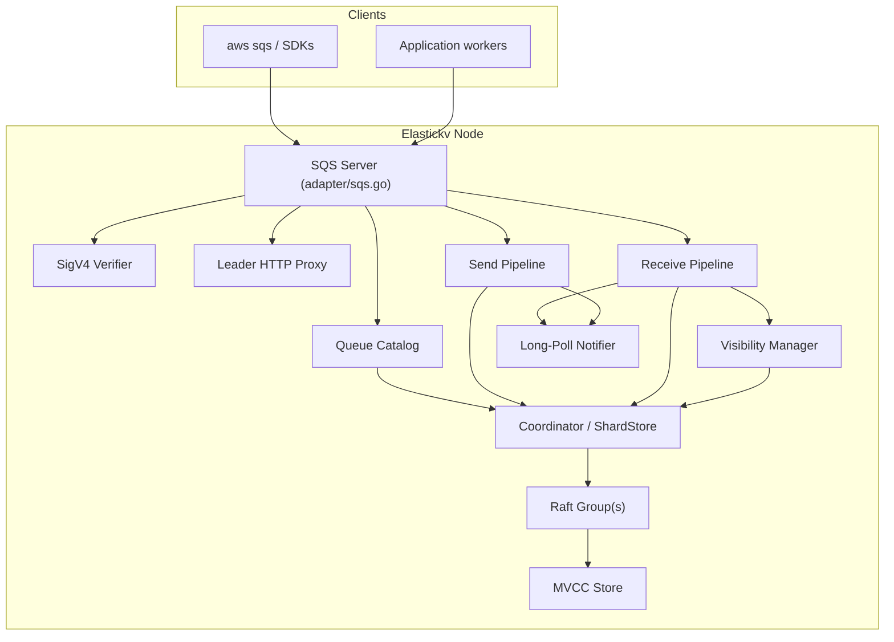
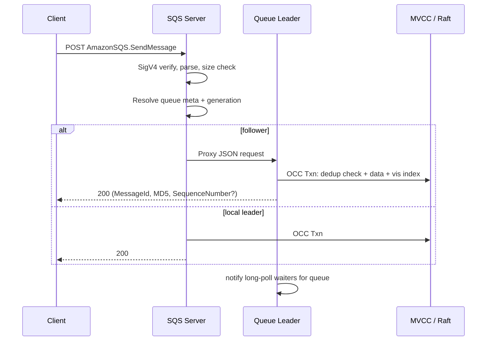
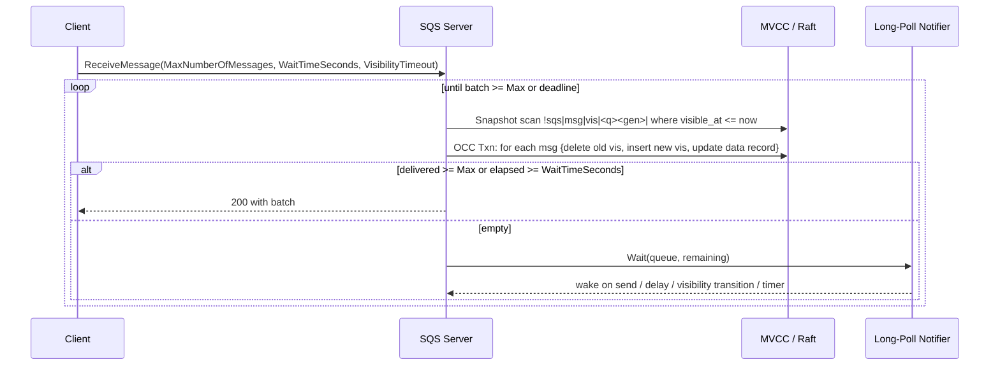
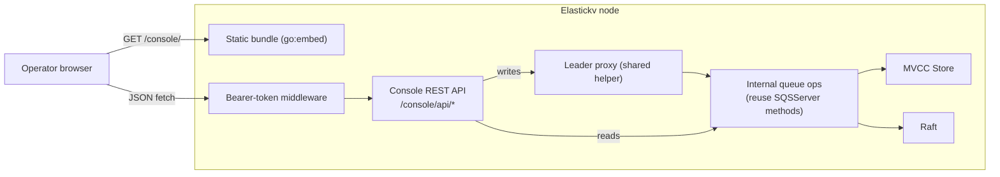

# SQS-Compatible Adapter Design for Elastickv

Status: Proposed
Author: bootjp
Date: 2026-04-24

---

## 1. Background

Elastickv exposes four protocol surfaces as of 2026-04-24:

1. gRPC (`RawKV` / `TransactionalKV`)
2. Redis-compatible commands (`adapter/redis.go`)
3. DynamoDB-compatible HTTP APIs (`adapter/dynamodb.go`)
4. S3-compatible HTTP APIs (`adapter/s3.go`)

There is no message-queue surface. This document proposes an HTTP adapter that exposes an Amazon SQS-compatible API while reusing the existing Raft, MVCC, HLC, shard-routing, leader-proxy, and SigV4 patterns that the DynamoDB and S3 adapters already established.

The goal is SQS compatibility for standard AWS SDK/CLI workflows against a self-hosted Elastickv cluster, not AWS feature parity. The adapter should transparently support `aws sqs`, the AWS SDK for Go v2, the JVM SDK, and boto3 against the same endpoint.

## 2. Goals and Non-goals

### 2.1 Goals

1. Add an `adapter/sqs.go` HTTP server that fits the existing adapter model.
2. Support both Standard and FIFO queues with their core semantics:
   - Standard: at-least-once delivery, best-effort ordering.
   - FIFO: strict order per `MessageGroupId`, exactly-once within a 5-minute deduplication window.
3. Expose visibility-timeout semantics without requiring a background sweeper.
4. Provide durable, Raft-replicated storage of queues and in-flight messages so that leader failover preserves every committed send, receive, and delete.
5. Support long polling (`WaitTimeSeconds` up to 20 seconds) without busy-waiting.
6. Reuse the DynamoDB/S3 adapter conventions for SigV4 auth, leader detection, leader proxying, and metrics.
7. Ship an operator-facing web console (§13) for browsing queues, peeking messages, and running administrative actions, on its own listener with token-based auth distinct from SigV4.

### 2.2 Non-goals

1. Full AWS SQS feature parity.
2. IAM, STS, cross-account policy, or resource-based policies. Static SigV4 key pairs only.
3. Server-side KMS encryption (`SqsManagedSseEnabled`, `KmsMasterKeyId`).
4. Cross-region replication or SQS-managed dead-letter redrive API (`StartMessageMoveTask` / `ListMessageMoveTasks`). DLQ re-drive by `RedrivePolicy` on `ReceiveMessage` **is** in scope.
5. High-throughput FIFO (unlimited per-group throughput via partitioning). Milestone 1 provides single-partition FIFO semantics.
6. Exactly-once pub/sub fan-out (that is SNS, not SQS).

## 3. Compatibility Scope

The adapter should focus on the API surface that real clients exercise. Two wire protocols must be accepted because AWS SDKs still split between them:

1. **JSON-1.0 protocol** (`X-Amz-Target: AmazonSQS.<Op>`, JSON body). Used by AWS SDK for Go v2, AWS SDK for JS v3, and `aws sqs` since CLI v2.15.
2. **Query protocol** (`application/x-www-form-urlencoded`, `Action=<Op>`, XML response). Used by boto3 < 1.34, JVM SDK v1, and older tooling.

The adapter should dispatch by request content-type / `X-Amz-Target` header and emit matching JSON or XML responses.

| API | Phase | Notes |
|---|---|---|
| `CreateQueue` | 1 | Standard + FIFO. Idempotent when attributes match. |
| `DeleteQueue` | 1 | Tombstones metadata; async reclaim. |
| `ListQueues` | 1 | Prefix filter, pagination token. |
| `GetQueueUrl` | 1 | |
| `GetQueueAttributes` | 1 | All core attributes. |
| `SetQueueAttributes` | 1 | VisibilityTimeout, MessageRetentionPeriod, DelaySeconds, ReceiveMessageWaitTimeSeconds, RedrivePolicy, MaximumMessageSize. |
| `PurgeQueue` | 1 | 60-second rate limit per AWS. |
| `SendMessage` | 1 | |
| `SendMessageBatch` | 1 | Up to 10 entries, 256 KiB total. |
| `ReceiveMessage` | 1 | Long polling, up to 10 messages. |
| `DeleteMessage` | 1 | |
| `DeleteMessageBatch` | 1 | |
| `ChangeMessageVisibility` | 1 | |
| `ChangeMessageVisibilityBatch` | 1 | |
| `TagQueue` / `UntagQueue` / `ListQueueTags` | 2 | |
| DLQ redrive on max receives | 1 | |
| `StartMessageMoveTask` and friends | Not planned | |
| Server-side KMS | Not planned | |

Payload limits match AWS defaults: 256 KiB per message, 120,000 in-flight messages per standard queue, 20,000 in-flight per FIFO queue. These should be enforced at the adapter, not silently truncated.

## 4. High-Level Architecture



The adapter sits beside Redis, DynamoDB, and S3 and reuses the same `store.MVCCStore` + `kv.Coordinator` data plane. Every state-mutating SQS operation (including `ReceiveMessage`, because receive flips visibility state) runs through the Raft leader. Read-only operations (`GetQueueAttributes`, `ListQueues`, `GetQueueUrl`, `ListQueueTags`) are served from any node using the `LeaseRead` fast path introduced in `docs/design/2026_04_20_implemented_lease_read.md`; see §7.8.

### 4.1 Leader proxy reuse

The DynamoDB adapter already has the right proxy shape (`adapter/dynamodb.go:proxyToLeader`): small request bodies, JSON envelope, re-emit response. SQS message payloads cap at 256 KiB, so the existing proxy pattern is sufficient and the streaming HTTP proxy that S3 needed (`docs/design/2026_03_22_implemented_s3_compatible_adapter.md §4.1`) is **not** required here. The SQS adapter should fork the DynamoDB proxy helper rather than reuse the S3 streaming proxy.

## 5. Data Model

### 5.1 Queue catalog

Queue metadata lives in a reserved control-plane keyspace, stored in the default Raft group (same pattern as the S3 bucket catalog and DynamoDB table catalog).

Suggested keys:

1. `!sqs|queue|meta|<queue-esc>` → queue metadata record
2. `!sqs|queue|gen|<queue-esc>` → monotonically increasing `generation` counter (uint64). Incremented on `DeleteQueue` so that stale message keys from the previous incarnation cannot be resurrected by recreating a queue with the same name.
3. `!sqs|queue|tombstone|<queue-esc><gen-u64>` → async reclaim marker

Suggested queue metadata fields:

1. `queue_name`
2. `queue_url`
3. `generation`
4. `created_at_hlc`
5. `is_fifo` (bool; derived from `.fifo` suffix on `CreateQueue`)
6. `content_based_dedup`
7. `visibility_timeout_seconds` (default 30)
8. `message_retention_seconds` (default 4 days, max 14 days)
9. `delay_seconds` (default 0)
10. `receive_message_wait_seconds` (default 0, max 20)
11. `maximum_message_size` (default 262144)
12. `redrive_policy` (DLQ ARN + `maxReceiveCount`)
13. `redrive_allow_policy`
14. `tags`

### 5.2 Message keyspace

Message state is split across three key families so that the hot path (`ReceiveMessage`) is a single bounded prefix scan.

1. `!sqs|msg|data|<queue-esc><gen-u64><message-id-esc>` → full message record (body, attributes, send metadata, receive count, current visibility token, current receipt handle).
2. `!sqs|msg|vis|<queue-esc><gen-u64><visible-at-u64><sequence-u64>` → visibility index entry. Value is the `message_id`. Ordered by `visible_at`, then by insertion sequence for stable FIFO.
3. `!sqs|msg|dedup|<queue-esc><gen-u64><dedup-id-esc>` → FIFO deduplication record, with expiry stored in the value. Populated only for FIFO or `SendMessageBatch` idempotent entries.
4. `!sqs|msg|group|<queue-esc><gen-u64><group-esc>` → FIFO group in-flight lock. Present only when the group currently has an unacknowledged delivered message. Value references the locking `message_id` and `visible_at`.

Key encoding reuses the DynamoDB adapter's byte-ordered segment encoder (`encodeDynamoKeySegment` in `adapter/dynamodb.go`). Strings are self-delimited with the `0x00 0xFF` / `0x00 0x01` escape-and-terminator scheme; integers are fixed-width big-endian `uint64`. This matches the S3 adapter key layout (`docs/design/2026_03_22_implemented_s3_compatible_adapter.md §5.2`) so the three adapters agree on ordering and parsing.

### 5.3 Message record

Body lives in the `!sqs|msg|data|...` record. The record is written once at `SendMessage` time and updated by `ReceiveMessage` and `ChangeMessageVisibility` via OCC transactions.

Fields:

1. `message_id` (server-assigned UUIDv4)
2. `body` (raw bytes) or `body_ref` for larger payloads (reserved; Milestone 1 inlines)
3. `md5_of_body`
4. `attributes` (AWS-defined: `SenderId`, `SentTimestamp`, `ApproximateReceiveCount`, `ApproximateFirstReceiveTimestamp`, etc.)
5. `message_attributes` (user-defined)
6. `message_system_attributes`
7. `send_timestamp_hlc`
8. `available_at_hlc` (send time + `DelaySeconds`)
9. `visible_at_hlc` (current visibility deadline; equals `available_at_hlc` while the message is available)
10. `receive_count`
11. `first_receive_timestamp_hlc`
12. `current_receipt_token` (opaque 16-byte random token; rotated on each receive)
13. `message_group_id` (FIFO only)
14. `message_deduplication_id` (FIFO only)
15. `sequence_number` (FIFO only, monotonic per queue)
16. `source_send_id` (batch sender id for deduped sends)

### 5.4 Visibility index

`!sqs|msg|vis|...` is the only key read by `ReceiveMessage`. The adapter must keep it in sync with the message record under every state change:

1. **Send:** insert `(visible_at = available_at_hlc, seq)` → `message_id`.
2. **Receive (n messages):** for each delivered message, delete the old visibility entry and insert a new `(visible_at = now + VisibilityTimeout, seq)` → `message_id`. The transaction also bumps `visible_at_hlc` and `current_receipt_token` on the data record.
3. **ChangeMessageVisibility:** same delete+insert swap as receive, validated against the supplied receipt handle.
4. **Delete:** remove both the data record and the visibility index entry.

Because `visible_at` leads the key, the next candidate messages are the first N keys in the prefix whose `visible_at ≤ now` — concretely, a scan over `[prefix|0, prefix|now+1)`. Invisible messages (`visible_at > now`) live past the upper bound of that range and are naturally skipped without a sweeper.

### 5.5 Receipt handles

Receipt handles must be opaque to the client, cheap to validate, and impossible to forge:

```text
receipt_handle = base64url(
  queue_gen_u64 | message_id_16 | receipt_token_16
)
```

`receipt_token` is the `current_receipt_token` field on the message record, rotated on every receive. A valid `DeleteMessage` or `ChangeMessageVisibility` must find the record, confirm the receipt token matches the current one, and — for `ChangeMessageVisibility` — confirm the message is still in flight (`visible_at_hlc > now`). Token mismatch returns `InvalidReceiptHandle` per AWS. No HMAC is needed because the token is a per-delivery shared secret persisted in the Raft log.

### 5.6 FIFO extensions

FIFO queues add three invariants on top of the standard schema:

1. **Group lock**: `!sqs|msg|group|<queue><gen><group>` is held by at most one message at a time. `ReceiveMessage` skips the entire group while the lock is held. The lock is released when the locking message is deleted, expires its visibility (and the next receive within the group rotates ownership), or the message retention expires.
2. **Deduplication**: `!sqs|msg|dedup|<queue><gen><dedup-id>` blocks a duplicate `SendMessage` for 5 minutes. For `ContentBasedDeduplication = true` the dedup id is `SHA-256(body)`.
3. **Per-queue sequence number**: `!sqs|queue|seq|<queue-esc><gen-u64>` → `uint64`, bumped by every FIFO send. Written into the message record for strict ordering.

## 6. Routing Model

### 6.1 Logical route key

All message keys for a given queue must hash to the same Raft group, so that `ReceiveMessage` only scans one shard and FIFO ordering/locking is single-writer.

Logical route:

```text
!sqsroute|<queue-esc><gen-u64>
```

Every internal prefix must normalize to this route:

1. `!sqs|msg|data|...`
2. `!sqs|msg|vis|...`
3. `!sqs|msg|dedup|...`
4. `!sqs|msg|group|...`

### 6.2 Required core changes

1. `routeKey(...)` (same function touched by the S3 design, see `docs/design/2026_03_22_implemented_s3_compatible_adapter.md §6.2`) gains an `!sqs|...` branch that trims to the queue route prefix.
2. `kv/ShardStore.routesForScan` gains an SQS-aware internal scan mapping so `ReceiveMessage`'s visibility-index scan lands on the correct shard.
3. The queue catalog (`!sqs|queue|meta|...`, `!sqs|queue|gen|...`) routes to a fixed control-plane group like the DynamoDB table catalog.

Queue-per-shard routing is the simplest model. A single hot queue that outgrows a shard is a known operational limit in Milestone 1; splitting a queue across shards while preserving FIFO is deferred.

## 7. Request Flows

### 7.1 `SendMessage`



Steps:

1. Validate message size (`MaximumMessageSize` from queue attrs, capped at 262144).
2. Compute `md5_of_body` and `md5_of_message_attributes`.
3. Resolve queue generation; if queue is tombstoned return `QueueDoesNotExist`.
4. Compute `available_at_hlc = now + max(queue.delay, per-message DelaySeconds)`.
5. In one OCC transaction:
   - For FIFO: check and insert `!sqs|msg|dedup|...`. On hit, return the existing message's ID (AWS semantics).
   - For FIFO: increment `!sqs|queue|seq|...` and write it into the record.
   - Write `!sqs|msg|data|...` and `!sqs|msg|vis|...`.
6. On commit, wake any long-poll waiters holding the queue's `sync.Cond` (see §7.3).

### 7.2 `ReceiveMessage`

`ReceiveMessage` is a **write** operation: it mutates `visible_at_hlc`, `receive_count`, and `current_receipt_token` on each delivered message and swaps the visibility-index entry. It must run on the leader.



Details:

1. Fence the snapshot scan with `coordinator.LeaseReadForKey(ctx, queueRoute)`. While the lease is valid (≤ `electionTimeout − leaseSafetyMargin`, currently 700 ms per `docs/design/2026_04_20_implemented_lease_read.md §3.2`) this returns immediately with no ReadIndex round-trip. Under sustained receive load this amortizes quorum confirmation across every receive in the lease window instead of paying one ReadIndex per call.
2. Snapshot-scan the visibility index for keys with `visible_at ≤ now`. Both Standard and FIFO queues read in page-sized chunks (page limit 1024) and keep paging forward (resuming from the last key returned) until `MaxNumberOfMessages` candidates survive the per-queue filters, or the end-of-range sentinel `visible_at = now+1` is reached. A small fixed-size first page (e.g., `2 * k`) is adequate for the common case, but the scan **must not** hard-cap at any fixed multiple of `k`, because the per-queue filters can legitimately hide an unbounded visible prefix:
   - FIFO queues hide every message whose `MessageGroupId` already holds an in-flight record (group lock).
   - Both queue types hide messages that have reached `redrive_policy.maxReceiveCount` — those are moved to the DLQ inside the same receive transaction (see step 6) and **not** returned to the caller, so a poison-message backlog can mask deliverable messages that sit further along in the index.
   A soft wall-clock budget (e.g., 100 ms) caps the overall scan latency when the queue is pathologically group-skewed or DLQ-saturated; the receive then returns whatever survived the filters.
3. Filter candidates. FIFO: skip any message whose group lock is held by another message; acquire the group lock on delivery. Standard + FIFO: skip (and DLQ-redrive in step 6) any message whose `receive_count` would exceed `redrive_policy.maxReceiveCount`. Filter-rejected candidates must **not** consume the `MaxNumberOfMessages` budget.
4. Run one OCC transaction per batch: for each candidate, verify the visibility entry still matches, rotate receipt token, set `visible_at_hlc = now + effective_timeout`, insert the new visibility entry, bump `receive_count`, **set `approximate_first_receive_timestamp` only on the first delivery** (subsequent redeliveries must preserve the original value — it is defined as the time the message was first received), and acquire FIFO group lock if applicable. A successful `Propose` also refreshes the lease (per `§3.3` of the lease-read doc), so a busy queue keeps its fast path warm without any extra work.
5. If the batch is empty and `WaitTimeSeconds > 0`, register a waiter on the queue's in-process condition variable and re-run step 1 on wake or timeout. Do not poll in a tight loop. On re-scan, the `LeaseRead` fence from step 1 stays local for the whole long-poll window — empty long polls cost O(1) quorum operations, not O(ticks).
6. If `receive_count > redrive_policy.maxReceiveCount`, move the message to the DLQ (see §7.6) atomically within the receive transaction and do not return it to the caller.

Lease invalidation handling: if the leader loses quorum during a long poll, `RegisterLeaderLossCallback` fires, the lease is cleared, and the next `LeaseReadForKey` falls back to `LinearizableRead`. That call fails if no quorum is available, and the receive returns a retryable error rather than quietly serving stale data.

### 7.3 Long-poll notifier

Long polling is local to the leader: every node keeps a `map[queueRoute]*cond` and wakes waiters whenever the set of deliverable messages on the queue may have grown. That includes any of these commit-time transitions:

1. A `SendMessage` (or `SendMessageBatch` entry) commits — the obvious case.
2. A `SendMessage` whose `DelaySeconds` has now elapsed — the notifier schedules a one-shot timer keyed off `available_at` when the delayed message commits, and the timer wakes the queue's waiters when it fires.
3. A `ChangeMessageVisibility` commits a `VisibilityTimeout` that moves the record's `visible_at` backward (including the AWS-permitted value of zero) — the message becomes immediately deliverable even though no send happened.
4. A message's visibility timeout naturally expires. Because each message has a known `visible_at`, the notifier tracks the smallest `visible_at` in-flight per queue and wakes waiters at that deadline (same timer wheel as the delay case).

Waking on (1) alone would leave long-polling receivers blocked while deliverable messages already sit in the visibility index — a correctness-adjacent bug, because clients would see latency spikes at exactly the moments they want prompt delivery. The timer-wheel approach keeps this O(in-flight messages on this leader), not O(wall-clock ticks).

**Leader failover bootstrap**. A newly elected leader inherits in-flight messages whose visibility deadlines were scheduled into timers on the previous leader; those timers do not Raft-replicate. Without a bootstrap step, those preexisting deadlines would pass with no event firing, so long-poll receivers would sleep until their `WaitTimeSeconds` expired even though messages became visible. On the `non-Leader → Leader` transition, the notifier therefore:

1. Scans `!sqs|msg|vis|` for each queue under this leader's shard(s) at `LinearizableRead` timestamp, extracts every record's `visible_at`, and repopulates the per-queue timer wheel with those deadlines.
2. For deadlines already in the past, fires an immediate wake (since the receive path will find them deliverable on its next scan).
3. Records the bootstrap as a single-shot operation keyed off the leader term so a node that leads, loses, and re-leads runs it again.

The bootstrap scan is bounded by in-flight count per queue (not total retention), so it is cheap in practice; clusters with extreme in-flight fan-out can lazy-populate the wheel on first receive per queue instead.

The notifier subscribes to the local FSM commit stream, not the RPC path, so that a mutation committed via another adapter node still wakes local waiters once the Raft log reaches this leader. On failover, waiters on the old leader get `AbortedError` from the coordinator and clients retry against the new leader; AWS SDKs already retry receive on connection errors, so this is acceptable.

### 7.4 `DeleteMessage`

AWS SQS `DeleteMessage` is **idempotent against stale receipt handles**: a caller that retries a delete after the visibility timeout expired (and a new consumer has since received the same message under a rotated token) is not an error case — SQS returns 200 success without deleting the now-in-flight record. Batch workers and SDK retry paths rely on this to avoid double-delivery failures, so this adapter preserves that behavior.

1. Parse the receipt handle → `(queue_gen, message_id, receipt_token)`.
   - If the handle is structurally malformed (bad base64, wrong length, wrong version byte) return `ReceiptHandleIsInvalid`. This is the only error case.
2. Load `!sqs|msg|data|<queue><gen><message_id>` at a snapshot timestamp.
   - **Missing record**: return 200 success. The message has already been deleted (either by us on a prior retry or by another consumer); the delete is a no-op.
   - **Token mismatch**: return 200 success **without deleting**. The caller is holding a stale handle after a rotation; the current in-flight consumer keeps its message.
   - **Token matches**: continue.
3. OCC transaction (with `ReadKeys` covering the data key and the current visibility entry) deletes the data record, the current visibility index entry, and (FIFO) releases the group lock. On `ErrWriteConflict` the whole pass — including step 2's token check — is retried so that a concurrent rotation that landed between our load and our commit is handled as a stale-handle no-op rather than a spurious delete.
4. `DeleteMessageBatch` aggregates entries into one multi-row OCC transaction and returns per-entry success/failure, applying the same stale-handle-is-success rule per entry.

### 7.5 `ChangeMessageVisibility`

Unlike `DeleteMessage`, `ChangeMessageVisibility` requires an in-flight record and a matching token — AWS returns errors on stale handles because the caller is trying to reach into a specific delivery. The adapter follows suit.

1. Parse the receipt handle. Malformed → `ReceiptHandleIsInvalid`.
2. Reject if `VisibilityTimeout > 12 hours` or negative.
3. Load the data record.
   - Missing record → `ReceiptHandleIsInvalid` (SQS `MessageNotInflight` on the record, but we reuse the structural code).
   - Token mismatch → `InvalidReceiptHandle`.
   - `visible_at_hlc <= now` (already expired back to visible) → `MessageNotInflight`.
4. OCC (with `ReadKeys` on data + old vis entry): delete old visibility entry, update `visible_at_hlc`, insert new visibility entry. The receipt token is **not** rotated (AWS does not rotate it for `ChangeMessageVisibility`).

### 7.6 DLQ redrive

If the target queue has a `RedrivePolicy`, the `ReceiveMessage` transaction that would push `receive_count` past `maxReceiveCount` should instead:

1. Read the target DLQ metadata by ARN (must resolve inside the same cluster; cross-cluster DLQ is out of scope).
2. In the same OCC transaction: delete the source data/vis keys, write the message to the DLQ keyspace with a fresh `message_id` and reset `receive_count`, and add `DeadLetterQueueSourceArn` to attributes.
3. The receive response omits the moved message.

Doing the move inside the receive transaction avoids a two-phase dance and keeps FIFO group locks consistent.

### 7.7 `PurgeQueue`

`PurgeQueue` bumps the queue generation counter and writes a tombstone for the old generation. All old message keys become unreachable via routing and are reclaimed asynchronously, mirroring the S3 bucket generation pattern.

### 7.8 Read-only operations and the follower-read fast path

Read-only APIs never mutate queue or message state, so they do not need the leader proxy. They use `coordinator.LeaseRead` / `LeaseReadForKey` (`docs/design/2026_04_20_implemented_lease_read.md §3.5`) directly on the node that receives the request:

| API | Fenced key | Read scope |
|---|---|---|
| `GetQueueUrl` | queue catalog route | `!sqs\|queue\|meta\|<queue>` |
| `GetQueueAttributes` | queue catalog route | `!sqs\|queue\|meta\|...` and derived counters |
| `ListQueues` | queue catalog route | prefix scan `!sqs\|queue\|meta\|` |
| `ListQueueTags` | queue catalog route | `!sqs\|queue\|meta\|<queue>.tags` |

The fast path:

1. Adapter calls `coordinator.LeaseReadForKey(ctx, route)`.
2. If the lease is valid (fast path, local wall-clock compare), the adapter serves the response from the local FSM snapshot at the returned applied index. No Raft traffic, no leader forwarding.
3. If the lease is expired or this node has never held one, `LeaseRead` falls back to `LinearizableRead`, which issues a ReadIndex through etcd/raft. On a follower this forwards to the leader and waits for the local apply to catch up to the returned read index — still one round-trip, but only on the cold path.
4. On any lease or ReadIndex error, return a retryable AWS error code (`ServiceUnavailable`) so SDKs back off.

This gives three operational properties:

1. **Followers serve read-only SQS traffic.** Under a healthy cluster, every node can answer `GetQueueAttributes` / `ListQueues` from local state for the entire lease window after it warms up, so read load spreads across the fleet instead of concentrating on the leader.
2. **Receive and read-only share a lease.** When a follower is also running `LeaseReadForKey` from mutating flows proxied to the leader, or when it piggy-backs on replicated applies, the lease stays warm and sustained read load pays essentially zero quorum cost.
3. **Safety bound is explicit.** Stale-read exposure is capped at `electionTimeout − leaseSafetyMargin` (currently 700 ms). This matches the trade-off the Redis and DynamoDB adapters already accept; SQS does not introduce a new class of staleness.

Mutating operations (`CreateQueue`, `DeleteQueue`, `SetQueueAttributes`, `SendMessage`, `ReceiveMessage`, `DeleteMessage`, `ChangeMessageVisibility`, `PurgeQueue`, `TagQueue`, `UntagQueue`) are unaffected by this fast path: they continue to proxy to the leader because they need a Raft `Propose`, not just a read fence.

## 8. Consistency Model

### 8.1 What the adapter guarantees

1. A successful `SendMessage` is visible to a subsequent `ReceiveMessage` at or after the send commit timestamp.
2. A successful `DeleteMessage` is not re-delivered.
3. A successful `ChangeMessageVisibility` is observed by every subsequent `ReceiveMessage`.
4. FIFO queues preserve strict per-group ordering across any leader failover, because the group lock and sequence counter are both MVCC-committed.
5. Deduplication within the 5-minute FIFO window is exact, backed by the OCC dedup-key insert.

### 8.2 What the adapter does not promise

1. Standard queues may deliver a message more than once if a client crashes before `DeleteMessage` — this matches AWS semantics.
2. Ordering across FIFO groups is undefined.
3. `ApproximateNumberOfMessages` is an estimate; Milestone 1 returns the exact count from a snapshot scan, which AWS also does approximately.
4. Cross-queue transactions are not supported (SQS does not offer this either).

### 8.3 Jepsen coverage

Given Elastickv's existing Jepsen harness (`jepsen/`) and the prior G1c/G0 work captured in memory, SQS must ship with a dedicated Jepsen workload under `jepsen/sqs/`:

1. **Standard queue**: check at-least-once delivery and no loss under `partition-majorities-ring`, `kill`, and `clock-skew` faults.
2. **FIFO queue**: per-`MessageGroupId` strict-ordering checker; duplicate delivery inside the 5-minute dedup window is a bug.
3. **Visibility**: assert that a message whose visibility has not expired is never delivered to a second concurrent consumer.

## 9. Authentication

SigV4 verification reuses the shared verifier added for the S3 adapter. Credentials come from the same static `--s3CredentialsFile` or a new `--sqsCredentialsFile` flag (both accepted). Region comes from `--sqsRegion` (default `us-east-1`).

Out of scope for Milestone 1: IAM policies, resource policies, `sqs:SendMessage` per-action allow/deny, temporary credentials via STS.

Unauthenticated requests are rejected with `MissingAuthenticationToken`. Bad signatures return `SignatureDoesNotMatch`. The SigV4 clock skew window follows AWS (5 minutes).

## 10. Operational and Configuration Changes

New server flags (parallel to `--s3*` and DynamoDB flags):

1. `--sqsAddress` — listener for the SQS HTTP server.
2. `--raftSqsMap` — `nodeID=host:port` pairs used by the leader proxy.
3. `--sqsRegion`
4. `--sqsCredentialsFile`
5. `--sqsEndpointBase` — base URL for emitted `QueueUrl` values (defaults to request `Host`).
6. `--sqsMaxMessageBytes` — cluster-wide ceiling; defaults to 262144.
7. `--consoleAddress` — listener for the operator web console; empty disables. See §13.
8. `--consoleToken` — bearer token required on the console listener when it is not loopback-only.
9. `--consoleReadOnly` — when true, the console listener refuses mutating actions (Send / Purge / Delete / Create).

New metrics (prefixed `sqs_`):

1. `sqs_request_total{op, status}`
2. `sqs_request_duration_seconds{op}`
3. `sqs_request_bytes{op}`
4. `sqs_messages_sent_total{queue, is_fifo}`
5. `sqs_messages_received_total{queue, is_fifo}`
6. `sqs_messages_deleted_total{queue}`
7. `sqs_messages_in_flight{queue}`
8. `sqs_longpoll_waiters{queue}`
9. `sqs_longpoll_wake_latency_seconds`
10. `sqs_dlq_redrive_total{queue}`
11. `sqs_proxy_to_leader_total{op}`

Structured log fields match the rest of the project: `queue`, `message_id`, `receipt_token_prefix`, `group_id`, `dedup_id`, `commit_ts`, `leader`.

## 11. Failure Handling and Cleanup

1. **Retention expiry**: a background reaper on the leader scans the visibility index for entries older than `send_timestamp + message_retention_seconds` and deletes them in bounded batches. Because visible_at ≤ send_time + retention implies the message is past retention in the common case, the reaper can mostly piggy-back on `ReceiveMessage` scans.
2. **Old-generation reclaim**: `DeleteQueue` and `PurgeQueue` write `!sqs|queue|tombstone|...` markers. A background task drops remaining keys for the old generation.
3. **Leader failover during long poll**: waiters drain, clients reconnect. Because every state change was Raft-committed before being acknowledged, no send or delete is lost.
4. **Clock skew**: visibility timeouts use the cluster HLC, not wall clock. Sends across nodes remain monotonic because the HLC leader renews the physical ceiling every second (same mechanism the Redis/DynamoDB adapters already depend on).

## 12. Testing Plan

### 12.1 Unit tests (`adapter/sqs*_test.go`)

1. Key encoding round-trips (queue, message, dedup, group).
2. Receipt handle format and validation.
3. SigV4 canonical request for both query and JSON protocols.
4. MD5-of-body and MD5-of-message-attributes vs AWS fixtures.
5. Visibility index update math (delete old + insert new) under concurrent receives.
6. FIFO dedup window boundary (4:59 vs 5:01).
7. Batch entry id uniqueness and partial failure encoding.

### 12.2 Integration tests

1. Single-node `CreateQueue` / `SendMessage` / `ReceiveMessage` / `DeleteMessage`.
2. Follower-ingress write proxying to leader (Standard and FIFO).
3. Follower `GetQueueAttributes` / `ListQueues` served via `LeaseRead` with no leader RTT; same call during a leader-loss window falls back and eventually errors out rather than returning stale data.
4. Long-poll wake on cross-node send.
5. Visibility timeout expiry restores delivery.
6. `ChangeMessageVisibility` extends and shortens correctly.
7. FIFO strict per-group order with 16 concurrent producers.
8. DLQ redrive at `maxReceiveCount`.
9. Leader failover mid-receive: no duplicate delivery to a second consumer within visibility timeout.
10. Sustained-load `ReceiveMessage` hits the lease fast path — assert the underlying `LinearizableRead` count grows O(lease-expiries), not O(receives).

### 12.3 Compatibility tests

1. `aws sqs` CLI smoke tests (both `create-queue .fifo` and Standard).
2. AWS SDK for Go v2 — `NewFromConfig` with a custom endpoint resolver.
3. boto3 with query protocol.
4. Celery with SQS broker (canonical real-world harness).

### 12.4 Jepsen workload

Under `jepsen/sqs/`, add `standard` and `fifo` test variants mirroring the existing Redis/DynamoDB harnesses, with `partition`, `kill`, and `clock-skew` nemeses. Treat duplicate delivery inside the visibility window or within the FIFO dedup window as a failure.

## 13. Console UI

A browser-based management console is bundled with the adapter so operators can inspect queues, send test messages, and run administrative actions (purge, delete) without reaching for a CLI. It is a first-class feature of the SQS surface, not a follow-up tool.

### 13.1 Goals and non-goals

Goals:

1. Read-only queue browsing from any node (uses the same `LeaseRead` fast path as §7.8).
2. Send, peek, purge, and delete against any queue, with visible leader routing so writes never quietly land on a follower.
3. Zero external build toolchain — shipped as a `go:embed` static bundle.
4. Operator-friendly auth that is distinct from the SigV4 credentials used by AWS SDK clients, so a human does not need to install `aws sigv4 curl` to load the console.

Non-goals:

1. Multi-tenant RBAC. Milestone 1 treats the console as single-role: whoever has the admin token can do anything.
2. Graphical metrics. Grafana already owns that surface; the console links out to the existing dashboards rather than duplicating them.
3. Message editing after send. SQS semantics do not support edit-in-place and neither does this console.

### 13.2 Serving model

The console runs on its own listener, controlled by a new `--consoleAddress` flag, exactly like `--metricsAddress` and `--pprofAddress`. Rationale:

1. Operators usually restrict console access to an internal VLAN or SSH tunnel. A separate port lets them firewall the console without touching the SQS API port.
2. The SQS API port is SigV4-only; the console port uses bearer tokens. Mixing the two authenticators on one port is error-prone.
3. Running the console on loopback by default makes the zero-config development posture safe.

```text
--consoleAddress "localhost:8090"          # TCP host+port; empty disables
--consoleToken   ""                        # bearer token; required for non-loopback
--consoleReadOnly false                    # if true, the console refuses mutating actions
```

`monitoring.AddressRequiresToken(addr)` already enforces "non-loopback requires a token" for metrics/pprof; the console reuses that helper.

### 13.3 Architecture



Key pieces:

1. `adapter/console.go` holds `ConsoleServer`, which embeds `*SQSServer` for access to the existing handler methods. It shares the queue catalog and message keyspace; no duplicate storage paths.
2. Static assets live under `adapter/console_ui/` (HTML + a single minimal JS file, both committed) and are served via `go:embed`. No npm/webpack pipeline.
3. The REST API uses JSON with plain status codes — it is **not** AWS-compatible. AWS SDKs do not talk to this endpoint.
4. Writes go through `proxyHTTPRequestToLeader` so a console tab pointed at a follower transparently hits the leader. Reads use `LeaseReadThrough` + local MVCC scans.

### 13.4 REST API surface

All paths are rooted at `/console/api/`. Requests carry `Authorization: Bearer <consoleToken>` when the token is configured.

| Method | Path | Purpose |
|---|---|---|
| `GET`  | `/queues` | list queues with attributes + approximate in-flight counts |
| `GET`  | `/queues/{name}` | one queue's attributes + live counters |
| `PUT`  | `/queues/{name}` | create queue; body is the same Attributes map as `CreateQueue` |
| `DELETE` | `/queues/{name}` | delete queue (same semantics as `DeleteQueue`) |
| `POST` | `/queues/{name}/purge` | purge queue (bumps generation, same as `PurgeQueue`) |
| `POST` | `/queues/{name}/messages` | send a message; body `{ body, delaySeconds?, attributes? }` |
| `GET`  | `/queues/{name}/messages?limit=N` | **admin peek**; non-destructive scan of up to N visible messages |
| `GET`  | `/queues/{name}/inflight?limit=N` | scan currently-invisible (in-flight) messages for debugging |
| `GET`  | `/health` | returns `{ leader: bool, node: "..." }` for the dashboard banner |

"Admin peek" is the one read path that bypasses the normal SQS surface: it scans `!sqs|msg|vis|` and `!sqs|msg|data|` at a snapshot read and returns body + attributes **without** rotating the receipt token or bumping visibility. This is intentional — the console is for observing state, not competing with workers. Clients that need at-least-once delivery must continue to use `ReceiveMessage`.

The peek endpoint rejects requests larger than `limit=100` and caps total response bytes so a bad operator click cannot DoS the node.

Error envelope follows Go idiom, not AWS:

```json
{ "error": "queue_does_not_exist", "message": "queue \"orders\" not found" }
```

### 13.5 Front-end

The bundled UI is a single-page HTML document plus one JS file. It is deliberately small so operators can read the source, and so it works over a slow SSH tunnel:

1. Top bar shows the node id, Raft leadership (green "leader" / grey "follower"), and lease state — the `/console/api/health` fields.
2. Left pane lists queues with a name filter, refreshing on a user-controlled interval (default 5s, can be paused).
3. Right pane shows the selected queue's attributes, approximate in-flight count, and three tabs:
   - **Peek** — paginated, non-destructive list of visible messages with body + attributes.
   - **In-flight** — currently-invisible messages and the wall-clock time until they reappear.
   - **Send** — a small form (body + optional delay) for posting a test message.
4. Destructive actions (Purge, Delete) are behind a confirm prompt that types the queue name to proceed, mirroring how the AWS console gates the same actions.
5. When `--consoleReadOnly` is set, the Send / Purge / Delete / PUT endpoints return `403 ReadOnly` and the UI greys out the corresponding buttons.

No framework, no bundler: the JS file is hand-written, runs in modern browsers (ES2020+), and uses the `fetch` API. This is in the same spirit as the redis-proxy runbook's small internal UIs.

### 13.6 Authentication

1. Loopback + no token configured: the console is open. This is the "one-liner dev" case.
2. Non-loopback or token configured: every `/console/*` request must carry `Authorization: Bearer <token>`. Missing or wrong token returns `401 Unauthorized`. No cookie / session; the token is supplied by the operator (typed into a small login screen and stored in `sessionStorage`).
3. The token is compared with `subtle.ConstantTimeCompare`, same pattern as `metricsToken` / `pprofToken`.
4. The console never sees or proxies SigV4 credentials; it uses the coordinator directly via `SQSServer` methods that already run on the authenticated-as-the-server path.

### 13.7 Failure and safety behaviors

1. **Lost leader during a mutating call**: the leader proxy returns `503 ServiceUnavailable`; the UI shows a toast with "leader unavailable — retrying…" and a manual retry button.
2. **Peek under leader loss on the local node**: `LeaseReadThrough` falls back to `LinearizableRead`; if that also fails, the API returns `503` and the UI marks the right pane as "read paused".
3. **Purge + Delete confirmations** require the exact queue name typed in a confirmation box. The server additionally rejects Purge when it was issued less than 60 s after the previous Purge, matching AWS's own rate limit.
4. **Large peek requests** are clamped server-side (`limit`, total body bytes). The client additionally enforces `limit<=100` so a URL-bar typo cannot hurt the node.

### 13.8 Observability

New metrics (prefixed `sqs_console_`) mirror the SQS API metrics:

1. `sqs_console_request_total{route, method, status}`
2. `sqs_console_request_duration_seconds{route, method}`
3. `sqs_console_peek_messages_total{queue}`
4. `sqs_console_write_total{queue, action, status}`
5. `sqs_console_auth_failure_total{reason}`

Structured logs include `route`, `queue`, `action`, `remote_ip`, `token_hash_prefix` (first 8 hex of SHA-256 — enough to identify a token in logs without leaking it).

### 13.9 Testing

1. Unit: REST-handler table tests using `httptest.NewRecorder` for auth / validation.
2. Integration: single-node cluster via `createNode(t, 1)`, drive the console API through `http.Client`, assert queue create → peek → purge → delete round-trip.
3. UI smoke: a `testdata/console_ui_smoke_test.go` compiles the static bundle through `httptest.NewServer` and runs a handful of headless HTTP GETs to confirm the assets actually ship. (No Chromium; too heavy for CI.)
4. Auth: token match, token mismatch, loopback-no-token, non-loopback-no-token (rejected at startup).

### 13.10 Out of scope for Milestone 1

1. SSO / OIDC / SAML. A bearer token is enough for the self-hosted operator use case this adapter targets.
2. Per-queue ACLs. Whoever holds the token can touch every queue.
3. Scheduled reports or message export. Observers run against metrics, not the console.

## 14. Rollout Plan

### Phase 1

1. Queue catalog, `CreateQueue` / `DeleteQueue` / `ListQueues` / `GetQueueUrl`.
2. Standard queue send/receive/delete/change-visibility with long polling.
3. SigV4 + JSON protocol; query protocol added opportunistically in the same phase.
4. Leader proxy.
5. Metrics and structured logs.
6. Unit + integration test coverage.
7. Console UI read-only views (queues list, queue detail, peek, health).

### Phase 2

1. FIFO queues (group lock, dedup, sequence number).
2. Batch APIs (`SendMessageBatch`, `DeleteMessageBatch`, `ChangeMessageVisibilityBatch`).
3. DLQ redrive.
4. Jepsen standard + FIFO workloads.
5. Tag APIs.
6. Console UI mutating actions (send, purge, delete, create), with the `--consoleReadOnly` gate.

### Phase 3

1. Query-protocol full XML fidelity for older SDKs.
2. `ApproximateNumberOfMessagesDelayed` / `NotVisible` accuracy.
3. Per-queue throttling and fairness across tenants.
4. Split-queue FIFO for very hot queues.
5. Console UI polish: in-flight tab with per-message countdown, filtering, dark mode.

## 15. Summary

The design choices are:

1. **Visibility index keyed by `visible_at`** removes the need for a background visibility sweeper — `ReceiveMessage` naturally skips invisible messages.
2. **Per-receive rotating receipt token persisted in Raft** gives forgery-resistant `DeleteMessage` / `ChangeMessageVisibility` without HMAC or external signing.
3. **One Raft group per queue** keeps FIFO ordering and group locking single-writer without cross-shard coordination.
4. **All mutating operations (including ReceiveMessage) go through the leader** keeps the consistency story identical to the DynamoDB adapter.
5. **Reuse of the DynamoDB adapter's proxy and key-encoding helpers** keeps the adapter small; the streaming S3 proxy path is not needed because SQS payloads are bounded.
6. **Lease-read fast path for read-only APIs and the `ReceiveMessage` scan fence** amortizes ReadIndex across bursts and lets followers serve `GetQueueAttributes` / `ListQueues` without a leader round-trip, reusing the mechanism already merged in `docs/design/2026_04_20_implemented_lease_read.md`.
7. **Embedded operator console on its own listener** (§13) gives read-only visibility from any node and a clearly-gated administrative path, without borrowing the AWS API surface or requiring SigV4 for humans.

The two repository-level prerequisites are:

1. SQS-aware internal-key routing and scan routing in `kv/`, matching the changes that `docs/design/2026_03_22_implemented_s3_compatible_adapter.md §6.2` already proposes for S3.
2. A leader-local long-poll notifier subscribed to the FSM commit stream.

With those in place, SQS compatibility can be added without changing the underlying storage, consensus, or HLC design.
