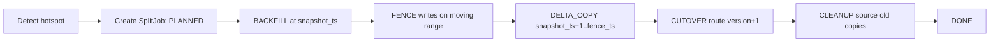

# Hotspot Shard Split Design for Elastickv

## 1. 背景

Elastickv には既にシャード境界の概念がありますが、ホットスポットに対して安全に自動分割するための制御面が不足しています。

現状（2026-02-17 時点）の実装状況:

- `distribution/engine.go` にアクセスカウントと閾値超過時の `splitRange` はある。
- ただし `RecordAccess` は実リクエスト経路から呼ばれていない。
- ルートテーブルはメモリ常駐で、ノード再起動で消える。
- ルート更新は `UpdateRoute` の append ベースで、重複/競合検出やバージョン管理がない。
- 分割後に別 Raft Group へデータ移送する仕組みがない。

結果として、実際の「ホットスポット分割」は未接続状態です。

## 2. 目的と非目的

### 2.1 目的

1. ホットレンジを自動検知し、範囲分割を実行できるようにする。
2. 分割片を別 Raft Group に移送し、負荷を分散できるようにする。
3. 分割中も整合性（書き込み喪失なし、MVCC/Txn 破壊なし）を維持する。
4. 失敗時に再開可能なジョブ方式で運用できるようにする。

### 2.2 非目的

1. Raft Group の自動生成・自動メンバー変更（既存 `--raftGroups` 内で完結）。
2. 自動マージ（split の逆操作）は本設計の対象外。
3. LSM/Pebble の最適化実装は後段（まず in-memory MVCC を基準）。

## 3. 要件

### 3.1 機能要件

1. Read/Write 負荷をレンジ単位で収集できる。
2. 閾値・ヒステリシスに基づいて分割候補を決定できる。
3. 分割キーをアクセス分布から決定できる（単純 midpoint 依存を脱却）。
4. バックフィルとカットオーバーを段階的に実行できる。
5. 分割後のルーティングを全ノードに反映できる。

### 3.2 整合性要件

1. カットオーバー境界で書き込みを取りこぼさない。
2. `!txn|...` と `!lst|...` を含む内部キーを正しく移送する。
3. stale route で旧グループに届いた書き込みを reject できる。

### 3.3 運用要件

1. 自動 split を ON/OFF できる。
2. 手動 split API を提供する。
3. ジョブ状態、失敗理由、処理速度を観測可能にする。

## 4. 全体アーキテクチャ

追加コンポーネント:

1. `Split Controller`
2. `Hotspot Detector`
3. `Route Catalog`（永続化 + バージョン管理）
4. `Range Migrator`
5. `Route Watcher`

責務分担:

| コンポーネント | 主責務 | 配置 |
|---|---|---|
| Hotspot Detector | 負荷集計と split 候補抽出 | 各ノード + リーダー集約 |
| Split Controller | split ジョブ状態機械、再試行 | 既定グループの leader |
| Route Catalog | ルート表と split ジョブの永続化 | 既定グループの内部メタデータ |
| Range Migrator | バックフィル/差分コピー | source/target leader 間 |
| Route Watcher | ルート表更新の配布とローカル反映 | 全ノード |

## 5. データモデル

`RouteDescriptor`:

- `route_id uint64`
- `start []byte`（inclusive）
- `end []byte`（exclusive, nil=+inf）
- `group_id uint64`
- `version uint64`（catalog 全体世代）
- `state` (`ACTIVE`, `WRITE_FENCED`, `MIGRATING_SOURCE`, `MIGRATING_TARGET`)
- `parent_route_id uint64`（split 由来のトレース）

`SplitJob`:

- `job_id string`
- `source_route_id uint64`
- `target_group_id uint64`
- `split_key []byte`
- `snapshot_ts uint64`
- `fence_ts uint64`
- `phase` (`PLANNED`, `BACKFILL`, `FENCE`, `DELTA_COPY`, `CUTOVER`, `CLEANUP`, `DONE`, `ABORTED`)
- `cursor []byte`（再開用）
- `retry_count uint32`
- `last_error string`

`AccessWindow`:

- `route_id uint64`
- `window_start_unix_ms uint64`
- `read_ops uint64`
- `write_ops uint64`
- `p95_latency_us uint64`（将来）
- `top_keys_sample`（分割キー選定用）

## 6. ホットスポット検知設計

### 6.1 計測点

Read:

- `kv/ShardStore.GetAt`
- `kv/ShardStore.ScanAt`

Write:

- `kv/ShardedCoordinator.groupMutations`（キー単位で加算）

### 6.2 判定式

レンジ score:

`score = write_ops * Ww + read_ops * Wr`

初期値:

- `Ww=4`, `Wr=1`
- `threshold=50_000 ops/min`
- 3 ウィンドウ連続超過で候補化
- split 実行後 cooldown 10 分

### 6.3 分割キー決定

1. サンプルキー分布から p50 を基本 split key とする。
2. 単一キー偏り (`top_key_share >= 0.8`) の場合は hot key 分離を優先。
3. `end=nil`（無限上限）でも観測キーに基づいて split key を算出可能にする。

## 7. Split 実行フロー

### 7.1 BACKFILL

1. `snapshot_ts = source.LastCommitTS()` を記録。
2. source から moving range の MVCC バージョンをエクスポート。
3. target へ idempotent import。
4. `cursor` をジョブに保存しながら進める。

### 7.2 FENCE

1. moving range を `WRITE_FENCED` に更新。
2. `ShardedCoordinator.Dispatch` で対象キー書き込みを `retryable` エラーで拒否。
3. `raft.Barrier` で fence 反映点を確定。

### 7.3 DELTA_COPY

1. `fence_ts = source.LastCommitTS()` を取得。
2. `(snapshot_ts, fence_ts]` の差分バージョンをコピー。
3. 反映完了後に cutover 可能。

### 7.4 CUTOVER

1. 親レンジを削除し、子レンジ 2 本を `ACTIVE` で公開。
2. moving child の `group_id` を target に切替。
3. route catalog `version` をインクリメント。

### 7.5 CLEANUP

1. 一定 grace 期間は source に旧データを残す（読み取り保険）。
2. 期間後に source 側の moving child データを GC。

## 8. ルーティング整合性

### 8.1 Route Version 付与

- `pb.Request`（`proto/internal.proto`）に `route_version` を追加。
- Coordinator は現在の route version を request に埋める。

### 8.2 所有権検証

- `kvFSM` に `groupID` と route resolver を注入。
- Apply 前に mutation key の `routeKey` 所有グループを検証。
- 不一致時は `ErrWrongShard` を返す。

### 8.3 stale route 対策

- stale ノードが旧ルートで送信しても、旧グループ leader が reject する。
- クライアントは再試行時に最新ルートを取得する。

## 9. 移送対象キーの定義

moving range 判定は raw key ではなく logical route key で行う。

対象:

1. user key 本体
2. list key（`!lst|meta|...`, `!lst|itm|...`）
3. txn key（`!txn|lock|...`, `!txn|int|...`, `!txn|cmt|...`, `!txn|rb|...`）

必要変更:

- `kv/txn_keys.go` の route key 抽出をエクスポートし、migrator から再利用可能にする。
- `store` 側に MVCC バージョン export/import API を追加する。

## 10. API 変更案

### 10.1 `proto/distribution.proto`

追加 RPC:

1. `ReportAccess(ReportAccessRequest) returns (ReportAccessResponse)`
2. `ListRoutes(ListRoutesRequest) returns (ListRoutesResponse)`
3. `WatchRoutes(WatchRoutesRequest) returns (stream WatchRoutesResponse)`
4. `SplitRange(SplitRangeRequest) returns (SplitRangeResponse)`
5. `GetSplitJob(GetSplitJobRequest) returns (GetSplitJobResponse)`

### 10.2 `proto/internal.proto`

追加 RPC:

1. `ExportRangeVersions(ExportRangeVersionsRequest) returns (stream ExportRangeVersionsResponse)`
2. `ImportRangeVersions(ImportRangeVersionsRequest) returns (ImportRangeVersionsResponse)`

## 11. 変更対象（実装単位）

1. `distribution/engine.go`
- route version/route state を持つ構造へ拡張
- append 更新ではなく CAS 更新 API 追加

2. `kv/shard_store.go`
- read path の access 記録追加
- moving/fenced レンジ時の挙動整理

3. `kv/sharded_coordinator.go`
- write path の access 記録追加
- `WRITE_FENCED` への retryable error 返却

4. `kv/fsm.go`
- route ownership 検証追加
- `ErrWrongShard` を返す分岐追加

5. `adapter/distribution_server.go`
- split/job/watch/report RPC 実装

6. `store/mvcc_store.go`（+ `store/lsm_store.go`）
- range export/import API 実装

## 12. 段階導入計画

### Milestone 1: 制御面

1. Route catalog の永続化
2. route version + watcher
3. 手動 split API（データ移送なし・同一 group 内分割）

### Milestone 2: データ移送

1. MVCC range export/import
2. BACKFILL/FENCE/DELTA/CUTOVER のジョブ化
3. 手動 split with target group

### Milestone 3: 自動化

1. access 集計
2. hotspot detector
3. auto split scheduler（cooldown/hysteresis）

### Milestone 4: 堅牢化

1. stale route reject
2. cleanup GC
3. Jepsen workload 追加

## 13. テスト戦略

### 13.1 Unit

1. hotspot 判定と split key 選定
2. route catalog CAS/バージョン遷移
3. split state machine の phase 遷移
4. ownership 検証

### 13.2 Integration

1. split 中の並行 write/read の整合性
2. FENCE 中の retryable エラー確認
3. リーダー交代・ノード再起動後のジョブ再開
4. cross-shard txn と split 併用

### 13.3 Jepsen

1. hotspot 負荷 + partition nemesis
2. hotspot 負荷 + kill nemesis
3. split 実行中の linearizability 検証

## 14. リスクと緩和策

1. リスク: split 中の write 停止時間が長い。
- 緩和: chunked delta copy、fence 範囲を moving child のみに限定。

2. リスク: stale route による誤配送。
- 緩和: leader 側 ownership 検証 + route version。

3. リスク: 内部キー取りこぼしで txn 解決不能。
- 緩和: logical route key ベースで export 対象を決定し、txn/list の専用テストを追加。

4. リスク: cleanup が早すぎると古い reader に影響。
- 緩和: grace 期間 + route version 監視 + 段階 GC。

## 15. 受け入れ基準

1. 手動 split で range が 2 分割され、片側を別 group へ移送できる。
2. split 中に write ロスが発生しない。
3. split 後に stale route write が reject される。
4. 障害復旧後に split job が再開され最終的に `DONE` になる。
5. 既存テスト + 新規 split テスト + Jepsen 拡張シナリオが通る。
